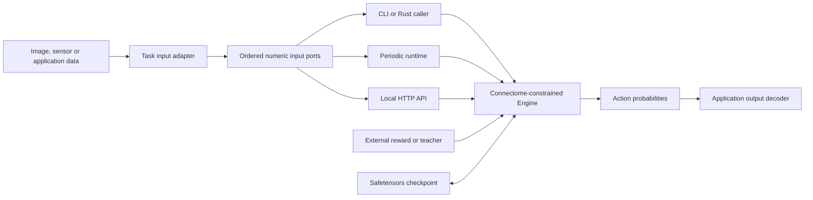

# Architecture

Novigrad has two separate execution paths. The **plastic rate engine** loads a fixed input→hidden edge table and a plastic hidden→output edge table. The **full-graph LIF runner** activates the much larger derived FlyWire graph but does not train it. The public Rust crate and default executable are `novi`. `novi_engine` provides the generic CLI; `novi_rt` provides periodic execution; the optional `novi_api` serves local HTTP requests.

## Plastic rate engine

The engine accepts arbitrary neuron IDs, circuit dimensions, and action counts. It maps external input IDs to a dense input vector. Fixed input edges use their source synapse counts and signs to construct normalized weights. A forward pass sums their drive at hidden cells, applies ReLU, retains the top configured fraction (10% by default), and divides by the maximum hidden activity. Hidden cells without input edges remain inactive; the FlyWire circuit retains 290 such KCs.

Plastic edges sum hidden activity at each output cell. Output cells map to actions; the engine averages each action's output-cell values, applies a configurable logit gain, then softmax. The default action mapping partitions sorted outputs by index modulo the action count; callers may supply another mapping. `forward` returns action probabilities, and the caller chooses an action and supplies one scalar reward.

For each existing plastic edge, a nonzero reward changes its weight in proportion to the presynaptic hidden activity and `reward × (chosen-action indicator − predicted action probability)`. The update preserves the source edge's sign and clips to the configured limit. With homeostasis enabled, all incoming plastic weights of an output cell are rescaled when their absolute sum exceeds 1. This can change an inactive edge's weight, so changed-weight counts are not eligibility counts. A zero reward makes no update. One reward consumes the pending forward pass; evaluation uses `clear_pending` to close a trial without learning.

This is an engineered scalar-reward rule, not a model of measured dopamine release. The engine stores no input generator, action-policy RNG, or episode cursor. An external runner owns these choices and the source of rewards.

## Topology, models, and validation

The default FlyWire training circuit is `data/pn_kc.tsv` plus `data/kc_mbon.tsv`: 319 ALPNs, 5,177 KCs, 96 MBONs, 27,848 fixed edges, and 62,261 plastic edges. The files constrain which connections can be used; the engine itself is dimension-flexible. The full graph is prepared independently as `data/edges_783.tsv`. [Data provenance](../data/README.md) describes the source snapshot and transforms.

Checkpoints are self-contained Safetensors with 14 tensors (schema 4; schema 3 is backward compatible) for IDs, topology, signs/counts, plastic weights, and output mapping. Metadata schema version 4 records the learning configuration and fixed output gains. Version 3 loads with unit gains; earlier development schemas are rejected. Save occurs at a completed trial boundary. [Model format](model-format.md) lists the tensors and validation rules.

The checked-in v1 confirmation evaluates binary, four-way, and XOR synthetic tasks across eight held-out seeds and three reward conditions, with rule reversal and noisy evaluation. See [v1 results](../results/V1_REPORT.md). Image examples use a training-only unsupervised adapter before the same circuit and have separate validation and reporting in [vision examples](../examples/vision/README.md) and [vision results](../results/VISION_REPORT.md).

## Execution limits

Each circuit executes on a CPU thread. Independent task experiments and HTTP requests may run on separate worker threads; one model instance serializes state changes. The repository's Cargo release configuration sets `target-cpu=native`, so a compiled binary is tuned for the build machine. The full-graph LIF path and two-layer rate path differ in both dynamics and scope. Neither path demonstrates whole-brain learning, biological time constants for the plastic model, real dopamine, hardware NPU execution, or embodied control.

## Modality and output adapters

The image adapter extracts label-free local gradients and pooled pixels, fits fractional PCA whitening on training images only, and maps signed components to nonnegative neuronal rate ports. A fixed-grid decoder applies the same character classifier four times for the synthetic CAPTCHA example.

The optional opponent readout assigns fixed +1/-1 gains to output neurons within each action group. It supplies positive and negative class evidence without changing the sign of any KC→MBON synapse. The gains are engineered external output wiring, not inferred anatomical neurotransmitters. The corresponding gain enters both the forward action score and its learning derivative and is stored in schema 4 Safetensors.

## A shared engine behind multiple interfaces

The core does not depend on image dimensions, class names, HTTP, or wall-clock scheduling. An adapter owns conversion from the application's data to the model's ordered input IDs. The application owns decoding and the source of rewards. API neuron IDs are decimal strings so JavaScript clients do not lose precision on U64 FlyWire identifiers.

State ownership is explicit: inference closes a trial without changing weights; online feedback consumes one forward trial; minibatch learning consumes several trials and applies the mean gradient once. An incomplete batch cannot be checkpointed or mixed with online updates. Per-sample buffers and gradient storage are reused.

The [periodic runtime](runtime.md) measures execution against a chosen period and skips missed scheduling slots. It provides soft real-time behavior under macOS, not hard deadline guarantees. The [local API](api.md) registers model files at startup and exposes controlled inference/learning operations; it does not accept arbitrary client-side file paths. Both interfaces use the same checkpoint and engine semantics.

[Optimization mechanisms](optimization.md) documents controlled changes to learning, activation and encoding. New modalities can reuse this architecture by implementing an input adapter and an output decoder; the biological circuit need not acquire modality-specific branches.

## Closed-loop environment adapter

The optional HighwayEnv example uses the same319 input ports and5 output actions. A fixed kinematic encoder produces rates, the policy samples a meta-action, the environment advances, and scalar reward returns to an episodic learner through the existing `/learn` endpoint. Four episodes share fixed weights before a batch update. Environment resets and model resets are separate: only independent training runs reset weights; validation and test freeze them. See [the game example](../examples/driving-game/README.md).

## Policy ensemble

`ensemble_policy.py` composes compatible categorical policies above the engine. Every member receives the same ordered input rates and returns probabilities over the same action meanings. Majority or probability-mean aggregation produces a decision while recording agreement and latency. Each member retains its own Safetensors checkpoint; `novi.ensemble.v1` JSON describes composition. This is an application-level decision layer with no Rust core or checkpoint-schema change.
