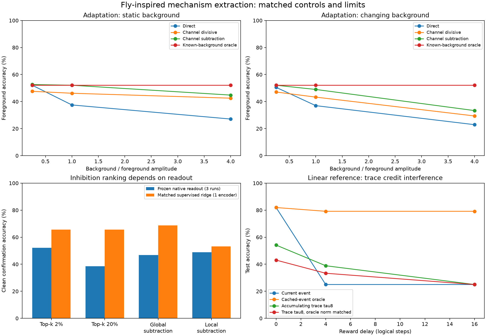

# Measured mechanism comparisons

These experiments translate three mechanism hypotheses from [MECHANISM_RESEARCH.md](MECHANISM_RESEARCH.md) into bounded software diagnostics: causal input adaptation, hidden-layer competition, and delayed credit assignment. They do not establish fly mechanisms. EmbeddingGemma vectors are language features, the hidden units are engineered Novi units, and static connectome edges cannot supply the dynamics or constants used here.

No experiment changed the core API or its defaults. All reported accuracies are greedy top-1 classification scores. The source reports retain correct-class probabilities, entropy, per-seed values, hashes, and individual runs.



Machine-readable cross-experiment summary: [summary.json](../../results/mechanism-bridge/summary.json).

## Results at a glance

| Question | Main measured result | Candidate verdict |
|---|---:|---|
| Can causal channel adaptation recover a foreground from a persistent language-feature background? | Static strength-1 background, sustained cue: direct 37.50%, divisive EMA 46.16%, subtractive EMA 52.08%; oracle subtraction 52.08% | Keep subtractive EMA as a task-specific candidate; strong and drifting backgrounds remain challenging stress cases |
| Does an APL-inspired subtractive transform improve the existing sparse representation? | On the reused 32 cases without added background, native 2% top-k gave 52.08%; global/local subtraction gave 46.88%/48.96% with the native readout | Keep native top-k for this checkpoint; do not infer an APL mechanism |
| Does a generic accumulating eligibility trace solve delayed reward? | At lag 16, exact cached event 79.17% test; every tested plain or norm-matched trace was 25.00% test | Discard these accumulating traces as delayed-credit candidates for this stream; retain the exact queue only as an oracle diagnostic |

## 1. Causal input adaptation

### Rules tested

For nonnegative input `x_t`, state begins at zero and is updated **after** the current output:

```text
a = exp(-1 / 8)
y_t is computed from m_t
m_(t+1) = a m_t + (1-a) x_t

direct:                 y_t = x_t
divisive EMA:           y_t = x_t / (0.05 + m_t)
subtractive EMA:        y_t = max(x_t - m_t, 0)
fixed divisive:         y_t = x_t / (0.05 + mean_training_input)
shuffled subtractive:   y_t = max(x_t - permute(m_t), 0)
oracle background:      y_t = max(x_t - known_background_t, 0)
```

The shuffled control permutes the 256 populated embedding ports and leaves padding fixed. The oracle receives the exact background vector and is unavailable to a causal deployed system. These rules are host-side filters; they are neither fitted ORN/PN dynamics nor evidence of biological gain control.

The full factorial contains 216 runs: three frozen checkpoints, three background strengths, two cue schedules, two background conditions, and six rules. Each episode lasts 48 logical ticks. The same foreground occurs at ticks 12 and 32, either for one tick or eight ticks. A drifting trial changes the distractor class at tick 24.

### Foreground accuracy averaged across three checkpoints

| Background | Schedule | Drift | Direct | Divisive EMA | Subtractive EMA | Fixed divisive | Shuffled subtractive | Oracle |
|---:|---|:---:|---:|---:|---:|---:|---:|---:|
| 0.25 | sustained 8 | no | 52.08% | 47.59% | 52.60% | 46.88% | 44.53% | 52.08% |
| 1.0 | sustained 8 | no | 37.50% | 46.16% | 52.08% | 35.42% | 36.91% | 52.08% |
| 1.0 | sustained 8 | yes | 36.98% | 43.29% | 48.96% | 34.90% | 36.26% | 52.08% |
| 4.0 | sustained 8 | no | 27.08% | 42.51% | 44.79% | 21.88% | 31.12% | 52.08% |
| 4.0 | sustained 8 | yes | 22.92% | 29.36% | 33.33% | 20.31% | 29.62% | 52.08% |
| 1.0 | pulse 1 | no | 37.50% | 53.65% | 52.60% | 35.42% | 42.19% | 52.08% |
| 4.0 | pulse 1 | yes | 22.92% | 36.46% | 35.42% | 20.31% | 28.65% | 52.08% |

The predeclared primary comparison supports the narrow claim that causal subtraction restored the measured static strength-1 foreground score to the oracle score. It does not generalize across the factorial: subtraction fell to 33.33% with a strength-4 drifting sustained background. Divisive EMA was better for an isolated pulse at strength 1, while subtraction was better for the sustained primary case. Fixed training means and shuffled channels did not reproduce the primary improvement, which is evidence that temporal, channel-aligned state mattered in this constructed task.

There is no detection gate. Small residual vectors can still be normalized by the downstream engine and cause an action. The foreground cases are the previously used 32 confirmation texts, evaluated with three already selected 128-dimensional, 2%-active checkpoints. This is repeated diagnostic evidence, not a fresh generalization split or three independent datasets.

Source: [adaptation.json](../../results/mechanism-bridge/adaptation.json).

## 2. Hidden competition and sparsity

### Rules tested

Let `h = relu(Wx)` be the reconstructed native pre-inhibition hidden activity. Every variant is row-wise max-normalized after inhibition:

```text
native top-k:       retain the largest ceil(0.02 * 5177) = 104 units
20% top-k:          retain the largest 1036 units
global subtraction: relu(h_i - g_global * mean_j(h_j))
local subtraction:  relu(h_i - g_local * mean_{j in group(i)}(h_j))
```

The 32 local groups are assigned by hidden index modulo 32. They have no anatomical meaning. Gains were calibrated on the old training rows only to approach 2% mean activity (`g_global=3.42445`, `g_local=3.41291`) and were then frozen. This is an APL-inspired competition test, not an implementation or identification of APL inhibition.

With the existing readout, the clean reused-confirmation results were:

| Hidden rule | Accuracy | Active units | Next-class hidden cosine | Separation delta: input cosine minus hidden cosine |
|---|---:|---:|---:|---:|
| Native 2% top-k | 52.08% | 104.0 | 0.5250 | +0.2368 |
| 20% top-k | 38.54% | 1036.0 | 0.6783 | +0.0835 |
| Global subtraction | 46.88% | 91.3 | 0.6193 | +0.1425 |
| Arbitrary-local subtraction | 48.96% | 91.7 | 0.6368 | +0.1250 |

At background ratio 1.0, all variants degraded: native 37.50%, 20% top-k 40.63%, global 38.54%, and local 37.50%. The native readout was trained with native 2% top-k, so those policy scores confound representation with readout compatibility.

An exploratory matched-readout control therefore fitted the same row-normalized, supervised dual-kernel ridge head (`lambda=0.1`) to 32 old training labels for each representation. On the clean reused confirmation set it scored 65.63% native, 65.63% 20% top-k, 68.75% global, and 53.13% local. At background ratio 1 it scored 31.25%, 43.75%, 40.63%, and 34.38%. All heads reached 100% training resubstitution accuracy.

The ridge control was added after inspecting the frozen-readout results. It uses the same small training labels, has no held-out tuning, and the variants have unequal effective activity despite sharing 5,177 coordinates. It shows that readout mismatch can change the ordering; it does not select global subtraction as a causal winner. The three Novi checkpoints share the same input-to-hidden tensor and therefore are not independent encoder replicates.

The 108 original rows cover three checkpoints, three datasets, three background ratios, and four hidden rules. The datasets are old training, old validation/calibration, and the reused 32-case confirmation set. Only the old training split was used for gain calibration and ridge fitting.

The sparse NumPy/SciPy shadow forward matched native engine probabilities to a maximum absolute error of `2.98e-8` on the parity rows. This validates the measured shadow calculation at numerical tolerance; it is not biological validation. The report also records checkpoint hashes and exact score roundtrips for the four saved ridge probes.

Source: [inhibition.json](../../results/mechanism-bridge/inhibition.json).

## 3. Delayed credit and eligibility

### Rules tested

This reference policy is a separate 319-by-4 float64 linear softmax model. For action `a_t` sampled from `p_t` on frozen unit-L2 feature `x_t`, the event and trace are:

```text
g_t = outer(x_t, onehot(a_t) - p_t)
lambda = exp(-1 / tau)
e_t = lambda e_(t-1) + g_t
W <- W + 0.03 * reward * credit
```

`current_only` applies delayed reward to the event at reward time. `exact_cached_gradient` queues the historical `g_t`. Trace conditions apply reward to the current accumulated `e_t`. The post hoc norm-matched trace rescales `e_t` to the norm of its corresponding cached event. That rescaling reads an oracle historical norm and is a diagnostic, not a usable mechanism.

Each condition used 2,048 sampled training actions and one delivered scalar reward per action (`+1` correct, `-1` wrong), followed by a warmdown equal to the lag. Scores use the old 24-case English test and 12-case Korean test. Three sampling seeds share a data split and are not independent datasets.

### Mean greedy accuracy across three sampling seeds

| Lag | Credit rule | English test | Korean test |
|---:|---|---:|---:|
| 0 | current / exact cached event | 81.94% | 83.33% |
| 0 | trace, tau 8 | 54.17% | 58.33% |
| 0 | norm-matched trace, tau 8 | 43.06% | 47.22% |
| 4 | current event | 25.00% | 27.78% |
| 4 | exact cached event | 79.17% | 86.11% |
| 4 | trace, tau 8 | 38.89% | 41.67% |
| 4 | norm-matched trace, tau 8 | 33.33% | 33.33% |
| 16 | current event | 25.00% | 19.44% |
| 16 | exact cached event | 79.17% | 83.33% |
| 16 | trace, tau 2 / 8 / 32 | 25.00% / 25.00% / 25.00% | 27.78% / 25.00% / 25.00% |
| 16 | norm-matched tau 8 / 32 | 25.00% / 25.00% | 25.00% / 25.00% |
| all | zero reward | 25.00% | 25.00% |

The original design had 42 runs; 12 post hoc norm-matched controls brought the report to 54. Norm matching did not restore delayed performance, so update amplitude alone does not explain failure. It even reduced tau-8 results at lags 0 and 4.

The trace equation itself passed isolated controls. Reward before any cue produced zero update; immediate plain and norm-matched updates were identical; and a single cue followed by blank events decayed exactly as `exp(-delay/tau)`. In a continuous stream, intervening cues changed both direction and size: for tau 8 at lag 16, the original-event projection was 5.915 and cross-talk L2 was 2.808, although the isolated-event retained coefficient would be 0.1353. The negative result therefore concerns cross-event assignment in this stream, not whether exponential decay was coded correctly.

The exact cached-event queue uses action-time gradients and is a historical oracle. It demonstrates that the reward signal can train when assigned to the correct event; it is not a biologically plausible synaptic trace. The tested accumulating trace is likewise a conventional engineered rule, not a per-synapse molecular model or the bounded per-action queue used elsewhere in the repository.

Source: [eligibility.json](../../results/mechanism-bridge/eligibility.json).

## Interpretation boundary

These diagnostics support implementation decisions within their measured tasks:

- retain causal subtractive adaptation for further held-out tests, with divisive adaptation as a competing model;
- retain native 2% top-k as the current checkpoint-compatible hidden rule;
- reject the tested generic accumulating traces for delayed credit in a dense cue stream.

They do not show that an ORN, PN, APL, KC, dopamine receptor, or mushroom-body compartment performs the corresponding computation here. A structural path or synapse count can constrain where a biological interaction might occur, but it cannot identify an EMA constant, subtraction gain, sparse threshold, or eligibility decay. Establishing those claims would require physiological dynamics, causal perturbations, and held-out predictions.

## Reproduction

With the repository's existing local embeddings and checkpoints:

```bash
.venv/bin/python examples/bio_bridge/adaptation_mechanism.py
.venv/bin/python examples/bio_bridge/inhibition_mechanism.py
.venv/bin/python examples/bio_bridge/eligibility_mechanism.py
.venv/bin/python examples/bio_bridge/summarize_mechanisms.py
.venv/bin/python -m unittest discover -s examples/bio_bridge -p 'test_*mechanism.py'
```

The scripts are CPU diagnostics and record source/data/checkpoint hashes in their JSON outputs.
