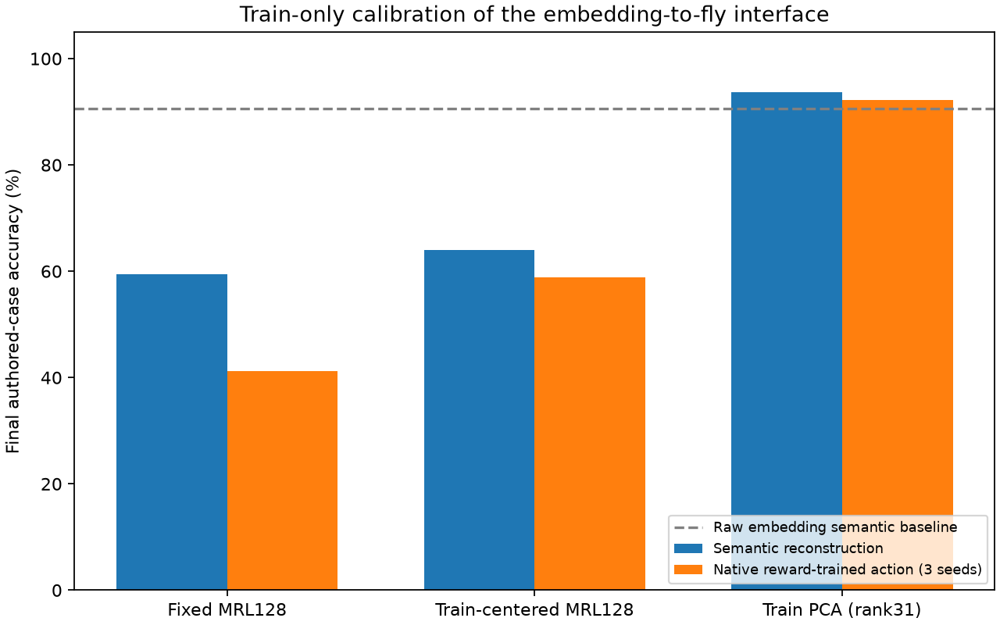

# Precise embedding-to-fly bridge results

## Scope

This experiment compares three frozen mappings from EmbeddingGemma features into a fixed fly-derived PN→KC topology. It measures semantic reconstruction and a separately reward-trained native action policy. It does not align language to recorded fly sensory activity, identify PN semantics, or demonstrate fly cognition.

The protocol follows [PRECISE_RESEARCH.md](PRECISE_RESEARCH.md). A schema-1 protocol lock froze data, source, mapping, decoder, checkpoint, permutation, and environment hashes before one final evaluation. The final set was not used for fitting or selection.



Machine-readable overview: [summary.json](../../results/precise-bridge/summary.json). Vector figure: [comparison.svg](../../results/precise-bridge/comparison.svg).

## Layered experiment

```text
authored text
  -> frozen EmbeddingGemma-300m, Classification prompt, normalized 768D
  -> train-only port transform
       fixed:    first 128 MRL coordinates
       centered: first 128 coordinates minus train mean
       PCA:      128 stored coordinates, fitted rank 31
  -> positive/negative split into 256 nonnegative ports + 63 zero padding ports
  -> fixed fly-derived PN→KC topology + native 2% top-k (104/5,177 KCs)
  -> either:
       semantic ridge -> reconstructed 128D input semantics -> candidate description
       native KC→MBON policy -> sampled-action reward learning -> four actions
```

The 32-row training set alone fit means, PCA, semantic ridge decoders, and native policies. The inherited 12-row validation set selected semantic ridge strength from `{0.01, 0.1, 1}` by category accuracy, then cosine, then smaller ridge. Native reward-training settings were fixed before validation and were not selected by semantic reconstruction.

The final set contains 64 authored texts: 32 scenarios, each represented by one English and one Korean text, balanced across water, food, warmth, and rest. Translation pairs are dependent observations. This is a new authored-family test for this round, not an external benchmark or biological dataset.

## Development choices

| Mapping | Mathematical rank | Selected semantic ridge | Validation semantic accuracy | Validation cosine |
|---|---:|---:|---:|---:|
| Fixed MRL128 | 128 | 0.01 | 83.33% | 0.8526 |
| Centered MRL128 | 128 | 0.1 | 83.33% | 0.8472 |
| PCA128 | 31 | 1.0 | 91.67% | 0.8515 |

PCA128 stores a `768×128` projection, but only 31 directions can be fitted after centering 32 rows. The remaining 97 projected coordinates are zero. Signed splitting and padding do not increase its information rank.

The development split was reused from earlier work. Its scores are selection evidence, not independent confirmation.

**Frozen provenance erratum:** the executable selection key is `(accuracy, cosine, -ridge)`, so an exact accuracy-and-cosine tie favors the smaller ridge. A narrative string frozen inside `development.json` incorrectly says “larger regularization.” None of the selected trials had an exact tie at both preceding metrics, so the recorded selections and results are unaffected. The metadata is preserved unchanged so hashes and exact replay remain valid.

## Final semantic reconstruction

The semantic decoder is a ridge map from native KC activity back to the original 128-dimensional MRL target. Nearest-description category measures closed-catalog semantic retrieval. It is not text generation, calibrated confidence, intent, or value.

| Mapping | All 64 | English 32 | Korean 32 | Mean embedding cosine | Exact catalog identity |
|---|---:|---:|---:|---:|---:|
| Raw embedding baseline | 90.63% | — | — | 1.0000 | 100.00% |
| Fixed MRL128 → KC → ridge | 59.38% | 68.75% | 50.00% | 0.7434 | 25.00% |
| Centered MRL128 → KC → ridge | 64.06% | 87.50% | 40.63% | 0.7430 | 18.75% |
| PCA128-rank31 → KC → ridge | **93.75%** | **100.00%** | **87.50%** | 0.7383 | 10.94% |

PCA exceeded both fixed mappings and the raw-embedding category baseline on this authored set. That result concerns the downstream closed-catalog category, not faithful reconstruction of each sentence: PCA had the lowest exact catalog-identity retrieval and slightly lower mean cosine. Its low-rank transform emphasized distinctions useful for the four categories while discarding case-specific detail.

The English/Korean gap remains material. Centering improved English category accuracy over fixed mapping but reduced Korean accuracy. PCA performed strongly in both languages, yet the 32 Korean rows are translations paired with the English scenarios and do not constitute an independent replication.

The 64 rows belong to eight authored scenario families. A descriptive family-cluster bootstrap with 10,000 resamples gave a PCA-minus-fixed category-accuracy difference of 34.38 percentage points and a percentile interval of 25.00 to 42.19 points. This interval describes sensitivity to resampling these eight authored families. It is not a population confidence interval, external generalization estimate, or substitute for independently collected families.

Source: [final.json](../../results/precise-bridge/final.json).

## Native reward-trained policy

This is a separate target and training process from semantic ridge calibration. For each mapping and seed 701–703, a fresh native engine received 2,048 sampled actions over 64 epochs in batches of eight, producing 256 optimizer updates. It received only scalar `+1` for a correct sampled action and `-1` otherwise. There was no teacher-action update. The three mappings used paired epoch permutations and action uniforms within each seed, although sampled actions could diverge.

| Mapping | Final greedy accuracy, mean of 3 seeds | English mean | Korean mean | Mean correct-class probability | Per-seed accuracy |
|---|---:|---:|---:|---:|---|
| Fixed MRL128 | 41.15% | 44.79% | 37.50% | 0.2554 | 34.38%, 48.44%, 40.63% |
| Centered MRL128 | 58.85% | 73.96% | 43.75% | 0.2627 | 59.38%, 59.38%, 57.81% |
| PCA128-rank31 | **92.19%** | **98.96%** | **85.42%** | 0.2772 | 93.75%, 92.19%, 90.63% |

The PCA policy result agrees in direction with semantic reconstruction, despite using a separate objective. It is still a small deterministic software study: the three seeds alter sampling and learned KC→MBON weights, while sharing data, topology, and transform.

Greedy accuracy must not be read as calibrated probability or stochastic deployment success. Even the PCA policies' mean correct-class probability was only 0.277, close to the four-class uniform value of 0.25. Small logit differences frequently produced the correct argmax. The experiment did not estimate calibration, rejection, or physical reward success.

Source: [native-final.json](../../results/precise-bridge/native-final.json).

### Post hoc untrained-policy control

After the locked final evaluation, one deterministic fresh untrained engine was scored on the same final set without training or tuning. Accuracy was 25.00% fixed, 18.75% centered, and 35.94% PCA, compared with the three-seed trained means of 41.15%, 58.85%, and 92.19%. This supports the narrow claim that the native PCA policy result depended on KC→MBON reward training rather than only the initial random policy.

The control was added after seeing final results, uses one deterministic initialization rather than three independent seeds, and leaves the locked final report unchanged. Its PCA-above-chance initial accuracy also shows why trained-versus-untrained values must both be reported.

Source: [untrained-final-posthoc.json](../../results/precise-bridge/untrained-final-posthoc.json).

## Port-placement sensitivity

Five fixed permutations, seeds 811–815, reassigned the first 256 signed feature values to PN input ports while leaving the 63 padding ports and all PN→KC edges unchanged. Every permutation fit its own semantic ridge using train32 and validation12. All five were frozen before the final evaluation; none was chosen on final results.

| Transform | Unpermuted final | Permutation mean | Permutation range | Interpretation |
|---|---:|---:|---:|---|
| Fixed | 59.38% | 64.38% | 59.38–73.44% | Original fixed placement was not uniquely favorable |
| Centered | 64.06% | 64.38% | 56.25–73.44% | Placement variance was comparable to the unpermuted score |
| PCA | **93.75%** | 79.38% | 65.63–90.63% | PCA remained useful, but its advantage depended partly on coordinate placement |

The PCA permutation results varied by 25 percentage points. None of five reached the unpermuted 93.75%, but five permutations are too few to estimate a full null distribution or prove a special anatomy-alignment mechanism. The transform assigns engineered language axes to non-exchangeable PN roots; port placement is therefore a real modeling choice and a confound, not recovered PN semantics.

Permutation values are repeated transformations of the same 64 dependent authored texts, not five new datasets.

Source: [permutation-final.json](../../results/precise-bridge/permutation-final.json).

## Wiring manifest

[wiring.json](../../results/precise-bridge/wiring.json) exports all 319 native input indices, their PN root IDs, PN→KC edge counts, and the engineered coordinate/sign assignment. Input order comes from the native checkpoint rather than TSV sorting. Indices 0–127 receive positive coordinates, 128–255 receive their negative counterparts, and 256–318 are padding.

The root IDs and edge counts are connectome-derived. The assignment of MRL or PCA coordinates and signs is engineered. In particular, PCA axis 0 on a named PN root is not evidence that the PN carries that semantic dimension or an odor identity.

## Protocol lock and reproducibility replay

The schema-1 [protocol-lock.json](../../results/precise-bridge/protocol-lock.json) records the following layers and their hashes:

1. train32, validation12, and authored final64 data;
2. frozen EmbeddingGemma encoder settings and holdout embeddings;
3. fixed, centered, and PCA port transforms;
4. fixed PN→KC topology, semantic decoders, native checkpoints, and permutation artifacts;
5. validation selection rule and single final-evaluation contract;
6. software and environment versions.

The [evaluation-lock.json](../../results/precise-bridge/evaluation-lock.json) binds the protocol hash to every final JSON, the holdout embeddings, and provenance. Verification rejects a changed locked artifact.

Here “replay” means exact reproducibility, not experience replay or a biological replay mechanism:

- Semantic replay refit all three transforms and decoders, reproduced all six tensor artifacts exactly, and reproduced saved final predictions exactly.
- Native replay independently repeated CPU training; all three mapping tensors, all nine checkpoint tensors, and every metric and prediction matched exactly.
- Extended replay refit all 15 permutation decoders from the original train32/validation12 inputs, reproduced every stored tensor array exactly, reproduced permutation final results apart from timing, and rechecked native final runs and aggregates. Original locked artifacts remained unchanged.
- A full fresh front-door run re-encoded the holdout with EmbeddingGemma and repeated development, freeze, evaluation, verification, and replay in an isolated directory. All arrays in 34 Safetensors artifacts matched exactly, including freshly generated embeddings, and semantic, native, and permutation final predictions were exact.

Sources: [semantic-replay.json](../../results/precise-bridge/semantic-replay.json), [native-replay.json](../../results/precise-bridge/native-replay.json), [extended-replay.json](../../results/precise-bridge/extended-replay.json), and [full-reproduction.json](../../results/precise-bridge/full-reproduction.json).

## Layer and command API

The commands correspond to distinct experimental layers:

For a fresh end-to-end run, use the front-door wrapper:

```bash
cd /Users/a405394/fly/nobi
.venv/bin/python examples/bio_bridge/run_neural_bridge.py all \
  --run-dir results/my-neural-run \
  --model /path/to/google_embeddinggemma-300m
```

`--run-dir` must name a fresh empty directory inside the repository so artifact paths remain portable. `--model` is configurable, but the wrapper verifies its weight revision against the training-feature provenance and rejects a mismatch. Individual phases—`develop`, `freeze`, `encode`, `evaluate`, `verify`, and `replay`—are also available when a staged lifecycle is required.

The equivalent fine-grained commands remain useful for inspecting each layer:

```bash
cd /Users/a405394/fly/nobi

# Import/encoder: encode the already-authored locked holdout.
.venv/bin/python examples/bio_bridge/encode_precise_holdout.py

# Ports, fixed circuit, semantic decoder, and validation-only ridge selection.
.venv/bin/python examples/bio_bridge/precise_bridge.py

# Independent native reward-readout development.
.venv/bin/python examples/bio_bridge/precise_native.py --development

# Fixed port-placement sensitivity development.
.venv/bin/python examples/bio_bridge/precise_permutation.py --development

# Freeze and verify the full schema before any final read.
.venv/bin/python examples/bio_bridge/precise_pipeline.py freeze
.venv/bin/python examples/bio_bridge/precise_pipeline.py verify

# One final evaluation runs semantic, native, and all permutation conditions.
.venv/bin/python examples/bio_bridge/precise_pipeline.py evaluate

# Reproducibility replay after final evaluation.
.venv/bin/python examples/bio_bridge/precise_pipeline.py replay
.venv/bin/python examples/bio_bridge/precise_native.py --replay
.venv/bin/python examples/bio_bridge/replay_precise_artifacts.py

# Descriptive summary and figures.
.venv/bin/python examples/bio_bridge/summarize_precise.py

# Post hoc diagnostics; these do not alter the locked final report.
.venv/bin/python examples/bio_bridge/check_precise_untrained.py
.venv/bin/python examples/bio_bridge/export_precise_wiring.py
```

The current result directory is already frozen and evaluated. Running `evaluate` there again is intentionally rejected; use `verify` and replay. A clean reproduction of the whole sequence must use a fresh isolated result directory or checkout and the same local model revision.

The final validation suite contained 97 passing tests: 67 bio-bridge tests and 30 other repository tests.

## Interpretation and limitations

The result supports PCA128-rank31 as the retained engineered interface for this task: it won validation, final semantic retrieval, and independently reward-trained native policy evaluation. The conclusion remains narrow because:

- the transform was fit from only 32 inherited development texts;
- the final 64 texts are 32 bilingual scenario pairs authored within this campaign;
- port permutations show that coordinate-to-PN placement materially affects results;
- semantic cosine, exact identity, category retrieval, and reward-policy accuracy measure different targets;
- three policy seeds and five permutations are repeated software conditions, not independent biological samples;
- there are no fly neural recordings, sensory stimuli, behavioral trials, or causal biological perturbations.

A separate neural-link/BCI stability extension is forthcoming. No result from that future extension is included or implied here.

The measured claim is: a train-only rank-31 PCA interface preserved task-relevant semantic structure and supported reward learning better than the two declared MRL mappings on one locked authored family set. It is not a biological sensory alignment.
