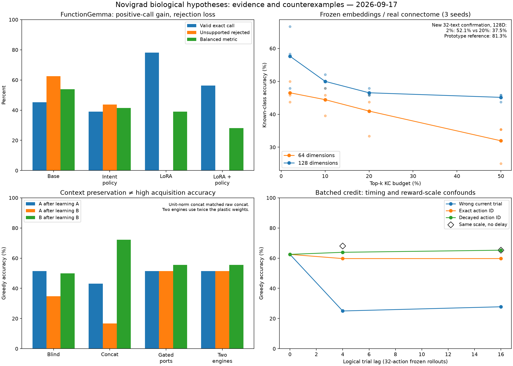

# 바이오 브리지: 측정된 진단 결과

이 디렉터리는 두 로컬 Gemma 인터페이스와 작은 `novi` 정책을 진단한다. 고정 EmbeddingGemma는 언어 특징을 만들고, FunctionGemma는 typed tool 제안을 만든다. 이 역할은 소프트웨어 역할이다. 언어 벡터는 냄새 부호가 아니며, top-k 활성은 APL 억제가 아니고, tagged queue는 시냅스 eligibility trace가 아니다. 어느 구성요소도 초파리 전전두엽 상동물이 아니다.

이 실험은 API를 변경하지 않으며 생물학적 메커니즘을 증명하지 않는다. 새로 작성한 텍스트는 총 **172개**다: FunctionGemma 80개, EmbeddingGemma 60개, 이후 sparsity confirmation 32개다. 모두 hand-authored protocol 사례이며 외부 독립 benchmark나 독립 생물학 replication이 아니다.

## 현재 상태와 주 지표

주 지표는 frozen FunctionGemma base의 **53.90625% balanced accuracy**로 유지된다. 유효 call 64개에서 45.3125%, no-call이어야 하는 negative 16개에서 rejection 62.5%의 평균이다. 네 core suite 중 세 진단을 유지하고 prompt intervention 하나를 버렸다. 이후 완료한 18-run streaming-credit follow-up은 별도로 보고하며 주 지표를 바꾸지 않는다.

## 1. FunctionGemma

모든 조건은 같은 80개 사례에서 greedy decoding을 사용한다. Adapter는 기존 `results/function-bridge/lora`이며 이 라운드에서 재학습하지 않았다.

| 조건 | Valid accuracy (64) | Negative rejection (16) | Balanced accuracy | Negative에서 잘못 낸 상태/변경 call |
|---|---:|---:|---:|---:|
| Base | 45.3125% | 62.5% | **53.90625%** | 6 |
| Base + policy | 39.0625% | 43.75% | 41.40625% | 9 |
| Adapter | 78.125% | 0% | 39.0625% | 13 |
| Adapter + policy | 56.25% | 0% | 28.125% | 10 |

Adapter는 positive call 일치를 높였지만 16개 abstention 사례를 모두 실패했다. 추가 policy 문장은 base와 adapter 모두의 balanced accuracy를 낮춰 폐기했다. Parser가 call을 내지 않은 경우도 의도적 semantic refusal이 아니라 malformed generation일 수 있다. Multi-turn history에는 모델이 스스로 만든 rollout이 아니라 정답 형태의 assistant call이 주어졌다.

## 2. EmbeddingGemma

Prototype은 상속된 train 32개로 class mean을 만들었다. Rejection margin은 상속된 validation 12개와 별도 unknown/ambiguous 8개, 총 20개에서 골랐다. 아래 평가는 새 60개 텍스트다.

| 차원 | Forced known | Forced unknown rejection | Forced balanced | Calibrated known | Calibrated unknown rejection | Calibrated balanced |
|---:|---:|---:|---:|---:|---:|---:|
| 64 | 77.08% | 0% | 38.54% | 47.92% | 75.00% | 61.46% |
| 128 | 81.25% | 0% | 40.63% | 50.00% | 83.33% | **66.67%** |
| 768 | 79.17% | 0% | 39.58% | 56.25% | 75.00% | 65.63% |

Calibration은 unknown rejection을 높이는 대신 known accuracy를 낮췄다. Calibration 20개와 negative test 12개뿐이므로 탐색적 결과다.

Google [공식 EmbeddingGemma model card](https://ai.google.dev/gemma/docs/embeddinggemma/model_card)는 MRL 출력 크기로 768, 512, 256, **128**을 명시하고 truncate 후 재정규화하도록 설명한다. 따라서 128이 공식적으로 문서화된 최소 MRL 크기다. 64차원은 model card 범위 아래의 의도적인 진단 조건이며 지원되는 MRL 설정으로 표현하면 안 된다.

`novi` proxy는 2개 차원 × 4개 active fraction × 3개 seed, 총 24개 정책을 학습했다. 각 정책은 상속 train 32개에서 sampled-action interaction 4,096회를 받았다.

| 차원 | 2% active | 10% active | 20% active | 50% active |
|---:|---:|---:|---:|---:|
| 64 | 46.53% | 44.44% | 40.97% | 31.94% |
| 128 | **57.64%** | 50.00% | 46.53% | 45.14% |

이후 고정한 128d 2% 대 20% checkpoint를 새 32개 텍스트에 재학습 없이 적용했다. 평균은 **52.08% 대 37.50%**였고 seed별 차이는 12.5, 18.75, 12.5 percentage point였다. 같은 32개에서 supervised prototype은 128d와 768d 모두 **81.25%**였다. Sparse 조건의 상대적 이득은 보였지만, 학습 정책이 간단한 supervised readout보다 크게 낮다는 부정적 결과도 함께 보고해야 한다.

세 seed는 같은 데이터에 적용한 stochastic training history이며 독립 dataset이 아니다. 영문/한국어와 semantic template도 서로 관련되어 item bootstrap은 정밀도를 과장한다. 생물학적 pattern separation을 확인한 결과가 아니다.

## 3. Context memory

5개 architecture × 3개 seed로 15회 실행했다. Context A를 학습한 뒤 B에서 label을 +1 회전시키고 다시 A를 refresh한다. A/B는 외부에서 주는 oracle tag다. Test/Korean split은 기존 자료를 반복 probe한 것이며 새 evaluation split이 아니다.

| Architecture | A 학습 후 A | B 학습 후 A 유지 | B 학습 후 B | Refresh 후 A | 제한 |
|---|---:|---:|---:|---:|---|
| Blind | 51.39% | 34.72% | 50.00% | 50.00% | engine 1개 |
| Concat | 43.06% | 16.67% | 72.22% | 31.94% | context port 2개 |
| Concat normalized | 43.06% | 16.67% | 72.22% | 31.94% | 사후 추가 control |
| Conjunctive | 51.39% | 51.39% | 55.56% | 54.17% | 분리 input port |
| Modular | 51.39% | 51.39% | 55.56% | 54.17% | engine 2개, plastic weight **2배** |

표는 greedy top-1 accuracy다. 표시된 probe의 correct-class softmax 평균은 대략 0.25–0.39이며 calibrated confidence나 sampled-action 성공률이 아니다. Conjunctive와 modular는 A를 유지했지만 context를 추론하지 않는다. Modular는 parameter가 두 배다. Normalized concat은 concat을 본 뒤 사후 추가했고, 이미 정규화된 semantic feature와 one-hot context를 함께 상수 배율로 줄여 사실상 같은 결과를 냈다.

이는 reversal/interference 진단이다. Extinction, erasure, renewal, reinstatement 또는 MB compartment를 시험하지 않는다.

## 4. Delayed credit

완료 artifact는 main 36회와 immediate amplitude control 6회, 총 42회다. 아래는 세 seed 평균의 **test greedy accuracy / mean correct-class probability**이며 괄호는 Korean이다.

| Lag | Wrong current | Exact tagged | Decayed tagged | Zero reward |
|---:|---:|---:|---:|---:|
| 0 | 62.50/0.266 (58.33/0.271) | 62.50/0.266 (58.33/0.271) | 62.50/0.266 (58.33/0.271) | 23.61/0.250 (19.44/0.250) |
| 4 | 25.00/0.250 (25.00/0.249) | 59.72/0.266 (58.33/0.271) | 63.89/0.260 (61.11/0.263) | 23.61/0.250 (19.44/0.250) |
| 16 | 27.78/0.250 (25.00/0.250) | 59.72/0.266 (58.33/0.271) | 65.28/0.253 (58.33/0.254) | 23.61/0.250 (19.44/0.250) |

같은 decay 상수를 reward amplitude에 즉시 적용한 control의 test accuracy는 lag-4 대응 68.06%, lag-16 대응 65.28%였다. Korean은 둘 다 58.33%였다. 따라서 delay 자체가 학습을 개선한다는 증거는 없다.

중요한 artifact가 있다. 32개 action을 같은 frozen weight snapshot에서 뽑고 reward 32개가 모인 뒤 한 번 학습한다. Lag 4와 16은 intervening update를 가로지르는 실제 sequential delay가 아니라 같은 sampling phase 안에 있다. Exact tag 결과는 이 batching 아래 저장한 row/action replay가 잘못된 current credit보다 낫다는 것만 보여준다.

Pending deque의 크기는 delay로 제한되지만 `seen`과 `trials_by_id`는 4,096개 ID/row를 모두 보존하므로 전체 history는 장기 실행에서 bounded가 아니다. Terminal drain의 wrong-current 조건은 새 trial이 없어 마지막 trial을 반복 사용한다. Greedy accuracy 약 60%를 stochastic reward 성공률로 읽어서도 안 된다. Correct-class probability는 대체로 0.25–0.27에 머문다.

### Streaming follow-up

Follow-up은 3 seeds × 2 lags × 3 credit rules, 총 18회다. Action 하나를 infer하고, due feedback을 전달하고, batch-1 update를 한 뒤 다음 action을 뽑는다. Rewarded action은 4,096개다. Lag 16에서는 마지막 trial을 재사용하지 않고 모든 outcome을 전달하기 위해 새 context/action 16개를 reward 없이 warm-down으로 사용한다. Learning rate는 이전 32-item batch와 update scale을 맞추기 위해 정확히 0.3/32인 0.009375다.

| Lag | Wrong current | Exact tagged | Decayed tagged |
|---:|---:|---:|---:|
| 0 | 54.17/0.266 (58.33/0.271) | 54.17/0.266 (58.33/0.271) | 54.17/0.266 (58.33/0.271) |
| 16 | 26.39/0.250 (25.00/0.249) | 55.56/0.266 (58.33/0.271) | 56.94/0.253 (61.11/0.254) |

각 cell은 test greedy accuracy / mean correct-class probability이고 괄호는 Korean이다. Lag 0에서 세 규칙은 동일하며 측정 출력도 같았다. Lag 16에서 exact action-ID credit은 aggregate lag-0 성능을 대체로 유지했고 wrong-current는 chance 부근으로 떨어졌다. 따라서 이전 32-action frozen sampling-phase artifact를 제거한 chronological **software** credit assignment 결과다.

새 구현은 pending row만 보유하고 monotonic scalar로 stale/duplicate ID를 거부했다. 기록된 maximum pending은 17이어서 이전 실험의 unbounded `seen`/row history를 제거했다. 그러나 seed별 baseline test accuracy가 87.5%, 50%, 25%로 매우 넓고 seed는 3개뿐이며 같은 상속 test item을 재사용했다. Decayed 조건은 모든 lag-16 reward에 `exp(-2)`를 곱하므로 amplitude confound가 남는다. Confidence interval, molecular eligibility, 물리 환경에 대한 주장은 지원되지 않는다.

## 생물학과 proxy의 경계

일차 문헌과 설계 근거는 [RESEARCH.ko.md](RESEARCH.ko.md)에 있다. [Lin et al. (2014)](https://pmc.ncbi.nlm.nih.gov/articles/PMC4000970/)은 APL 출력, KC sparsity/decorrelation, 비슷한 냄새 구별 사이의 인과 근거를 제시했지만 sparsity가 유일한 매개임을 증명하지 않았다. [Hige et al. (2015)](https://pmc.ncbi.nlm.nih.gov/articles/PMC4674068/)와 [Handler et al. (2019)](https://pmc.ncbi.nlm.nih.gov/articles/PMC9012144/)은 정의된 초파리 회로에서 구획과 순서에 민감한 dopamine plasticity를 보였다. 이 결과를 언어 정책에 직접 동일시할 수 없다.

| 소프트웨어 요소 | 실제 역할 | 증명하지 않는 것 |
|---|---|---|
| Frozen EmbeddingGemma | 재현 가능한 언어 feature | 냄새/KC code |
| `active_fraction` top-k | sparse computation 조절 | APL 억제 메커니즘 |
| Sampled-action update | 작은 policy 진단 | dopamine/시냅스 생물학 |
| Oracle context/routing | 명시적 task 분리 | context 발견, MB compartment |
| Tagged queue | host bookkeeping | synaptic eligibility trace |
| FunctionGemma call | 실행 전 executive symbol 제안 | 실제 행동, 신뢰된 상태, fly PFC |

향후 구조는 감각 feature, intent proposal, 짧은 host memory, 학습 value/action, 긴 context, 실행 검증을 분리해야 한다. FunctionGemma는 요청 의미를 제안하고, host와 policy가 outcome-linked memory와 유효성을 담당한다. PFC analogy는 사용하지 않는다.

## 재현

Repository root에서 실행한다. 로컬 모델과 기존 weight를 사용한다. 현재 function/embedding script는 Apple MPS를, context/delayed-credit는 CPU `novi`를 사용한다. 명령은 같은 결과 파일과 checkpoint를 덮어쓸 수 있다.

```bash
python examples/bio_bridge/function_scenarios.py --out results/bio-bridge/function-base.json
python examples/bio_bridge/function_scenarios.py --intent-policy --out results/bio-bridge/function-policy.json
python examples/bio_bridge/function_scenarios.py --adapter results/function-bridge/lora --out results/bio-bridge/function-adapter.json
python examples/bio_bridge/function_scenarios.py --adapter results/function-bridge/lora --intent-policy --out results/bio-bridge/function-adapter-policy.json
python examples/bio_bridge/embedding_scenarios.py
python examples/bio_bridge/confirm_sparsity.py
python examples/bio_bridge/context_memory.py --output results/bio-bridge/context-memory.json
python examples/bio_bridge/context_memory.py --append-normalized-control
python examples/bio_bridge/delayed_credit.py
python examples/bio_bridge/streaming_credit.py
python -m unittest discover -s examples/bio_bridge -p 'test_*.py' -q
```

수치의 source of record는 hash, per-case 출력, per-seed 값, probability, checkpoint, limitation을 담은 `results/bio-bridge/*.json`이다.

큐 용량은 `delay + 1`로 강제하며 초과 시 다음 ID를 변경하지 않는다. 제한 검사를 추가한 재실험은 모든 지표와 학습 횟수가 같았다. 다만 metadata key 직렬화 순서가 고정되지 않아 실행 간 checkpoint 파일 hash는 달랐다. 따라서 byte 단위 재현성을 주장하지 않으며 현재 파일 hash를 보고서에 기록했다.



추가 history ablation 16문항에서 base는 전체 이력 10/16, 마지막 사용자 메시지만 사용하면 9/16이었고 adapter는 각각 12/16이었다. 사후 semantic-agreement gate는 adapter의 negative 7개를 거절하여 balanced accuracy 52.34%를 얻었지만 valid 정답은 50개에서 39개로 줄었다. Base의 53.91%보다 낮으며 기본 실행 경로에 적용하지 않았다. 이 gate는 마지막 메시지만 읽어 이력 의존 intent를 해결하지 못한다.

후속 실험: [지속·단발 입력, 신호 세기, 반복 학습 비교](SIGNAL_RESULTS.ko.md) 및 [일차 문헌 연구](SIGNAL_RESEARCH.ko.md).

메커니즘 추출: [감각 적응·숨은층 억제·보상 흔적 비교 실험](MECHANISM_RESULTS.ko.md) 및 [일차 문헌과 계산 규칙](MECHANISM_RESEARCH.ko.md).

임베딩 기반 상태 판독: [KC/MBON 복원 및 인과 대조 결과](THOUGHT_RESULTS.ko.md), [연구와 실제 초파리 측정 조건](THOUGHT_RESEARCH.ko.md).
