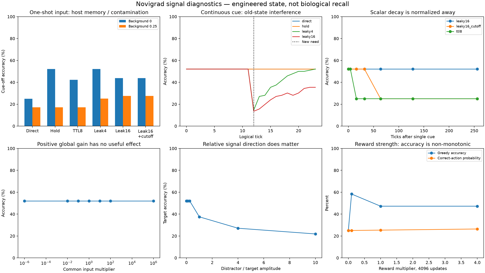

# 신호 schedule과 strength: 측정 결과

## 범위와 네 가지 의미

Frozen temporal/inference-strength 진단은 이전 campaign에서 선택한 128차원, 2%-active `novi` checkpoint와 같은 32개 영문/한국어 confirmation text를 재사용한다. Training-strength/acquisition은 다른 범위를 사용한다. 상속된 Gemma-bridge dataset의 train 32개로 새 engine을 만들고 test 24개와 Korean 12개에서 평가한다. 어느 쪽도 이 라운드의 새 holdout이 아니다. 세 seed는 같은 데이터와 anatomy를 공유하는 sampling history이며 독립 biological replicate가 아니다. Tick은 software step이지 초가 아니다. Accuracy는 greedy top-1이고 correct-class probability는 대체로 0.25 부근이므로 calibrated confidence가 아니다.

“기억”을 네 가지로 분리해야 한다.

| 의미 | 이 실험의 구현 | 증명하지 않는 것 |
|---|---|---|
| Maintained input | Cue vector를 cue-on tick마다 다시 제공 | Memory |
| Cue-off host memory | `hold`, `ttl8`, leaky preprocessing이 `novi` 밖에서 vector를 저장/혼합 | 학습된 recurrence 또는 working-memory neuron |
| Associative weights | 기존 checkpoint weight가 현재 feature를 action에 연결 | Call 사이 temporal trace |
| One-shot acquisition | 네 class exemplar마다 sampled action 한 번을 reward | 안정적인 one-example learning |

따라서 핵심 대비는 **direct 25.00% 대 hold 52.083%**다. 이 차이는 host가 마지막 nonzero vector를 복사해 제공한 결과이며 feedforward engine이 학습한 recall이 아니다. 생물학적 근거와 경계는 [SIGNAL_RESEARCH.ko.md](SIGNAL_RESEARCH.ko.md)에 있다.



## Frozen inference schedule

Episode는 24 tick이며 tick 12에서 다른 class로 바뀐다. `continuous`는 매 tick, `one_shot`은 tick 0과 12, `periodic4`는 네 tick마다 cue를 준다. Full factorial은 **324 temporal runs**다: 3 seeds × 3 schedules × 2 doses × 3 backgrounds × 6 host modes. Primary mask는 두 initial-cue tick을 제외한다. Cue-off mask는 실제 pulse schedule에서 계산하며 continuous에는 cue-off 관측이 없다.

### Clean, per-pulse dose

괄호는 cue-off-only accuracy다.

| Host mode | Continuous | One shot | Periodic-4 |
|---|---:|---:|---:|
| Direct | 52.08% | **25.00% (25.00%)** | 29.92% (25.00%) |
| Hold | 52.08% | **52.08% (52.08%)** | 52.08% (52.08%) |
| TTL 8 | 52.08% | 42.23% (42.23%) | 52.08% (52.08%) |
| Leaky τ=4 | 47.25% | 52.08% (52.08%) | 49.05% (48.61%) |
| Leaky τ=16 | 40.06% | 43.75% (43.75%) | 40.86% (40.62%) |
| Leaky τ=16 + cutoff | 40.06% | 43.75% (43.75%) | 40.86% (40.62%) |

Direct one-shot의 cue-off row는 zero라 uniform policy가 된다. Greedy tie가 class 0을 골라 balanced label에서 25%다. Hold는 host-stored vector를 반복하므로 원래 52.08% prediction을 그대로 재현한다. TTL 8은 선언된 lifetime 뒤 zero로 돌아가며 42.23%는 held tick과 zero tick의 산술적 혼합이다.

Positive leaky trace는 이 engine에서 forgetting이 아니다. Native hidden activity가 maximum으로 정규화된다([구현](../../src/plastic.rs#L315-L320)). Pure single-cue silence sweep에서 τ=16은 unit-gain norm이 `exp(-16)`, 약 1.13×10⁻⁷까지 줄어도 tick 256에서 52.083%를 유지했다. Cutoff는 tick 64까지 25%로 돌아갔고 TTL 8은 sampled tick 16에서 이미 25%였다. Forgetting은 명시적 TTL 또는 cutoff를 넣을 때만 생긴다. Norm 0.05 cutoff는 host가 정한 비보정 규칙이다.

### Background 0.25

Nominal cue-off tick에 nonzero distractor를 넣었다. Hold와 TTL은 “아무 nonzero input”을 cue로 간주하므로 distractor가 memory를 덮어쓰거나 refresh한다. 표는 `post_initial_cue_ticks`를 보고한다. Periodic schedule에서는 이 mask에 cue-off tick뿐 아니라 이후 periodic cue pulse도 포함된다. Cue-off-only 값은 `temporal.json`에 별도로 있다.

| Host mode | Continuous | One shot | Periodic-4 |
|---|---:|---:|---:|
| Direct | 50.52% | 17.19% | 23.25% |
| Hold | 50.52% | 17.19% | 23.25% |
| TTL 8 | 50.52% | 17.19% | 23.25% |
| Leaky τ=4 | 44.98% | 25.09% | 36.51% |
| Leaky τ=16 | 39.30% | 27.60% | 34.85% |
| Leaky τ=16 + cutoff | 39.30% | 27.60% | 34.85% |

이는 robust cue detection이 아니다. 실제 gate에는 trusted event marker 또는 별도로 검증한 novelty/reliability detector가 필요하다. Target label 사용은 truth leakage다.

### Dose와 switch interference

Per-pulse는 pulse마다 amplitude 1이고 equal-total은 12-tick phase의 cue amplitude 합을 1로 맞춘다. 모든 **clean** schedule/mode accuracy가 두 dose에서 동일했다. 그러나 background 0.25를 고정하면 cue/background의 상대 방향이 바뀐다. Continuous-direct all-tick accuracy는 **50.52%에서 26.56%**, periodic-direct는 **25.52%에서 22.40%**로 내려갔다. Native normalization은 공통 global scale을 제거하지만 relative mixture 변화는 제거하지 않는다.

Tick 12 switch에서 오래 남는 trace는 과거와 새 feature 방향을 섞는다. Clean continuous의 first phase는 모든 leaky mode에서 52.08%였지만 second phase는 τ=4에서 40.10%, τ=16에서 26.82%로 떨어졌다. Direct는 52.08%를 유지했다. 긴 persistence가 recall을 강화하기보다 interference를 만들었다.

## Inference-time strength

Global gain 0, 10⁻⁶, 0.01, 0.1, 1, 10, 100, 10⁶을 시험했다. 모든 positive gain의 prediction은 같았고 gain 1 대비 최대 probability 차이는 **5.96×10⁻⁸**이었다. Zero gain만 uniform 25%가 되었다. 이 engine은 global scalar amplitude를 strength로 표현하지 않는다.

반면 relative direction은 영향을 주었다. Distractor feature 비율을 0, 0.1, 0.25, 1, 4, 10으로 높이면 input 방향이 회전하며 prediction이 바뀌고 correct probability가 0.25 부근 또는 아래로 감소했다. 이는 feature competition이지 odor concentration이 아니다.

## Training strength와 one-shot

조건마다 새 engine, batch-1 online update, learning rate 0.009375, active fraction 2%, identity class-action map을 사용했다. Strength 18 runs, one-shot/replay 9 runs, paired massed/spacing control 3개다.

| 조건 | Test accuracy / probability | Korean accuracy / probability | Weight Δ L2 |
|---|---:|---:|---:|
| Input gain 0.01, reward 1 | 47.22% / 0.2535 | 36.11% / 0.2550 | 0.7324 |
| Input gain 100, reward 1 | 47.22% / 0.2535 | 36.11% / 0.2550 | 0.7324 |
| Reward 0 | 25.00% / 0.2499 | 25.00% / 0.2498 | 0 |
| Reward 0.1 | 58.33% / 0.2504 | 61.11% / 0.2505 | 0.0858 |
| Reward 1 | 47.22% / 0.2535 | 36.11% / 0.2550 | 0.7324 |
| Reward 4 | 47.22% / 0.2638 | 38.89% / 0.2697 | 2.9542 |

Input gain 0.01과 100은 gain 1과 sampled action이 정확히 같고 weight/probability 차이는 roundoff 수준이었다. Reward magnitude는 policy-gradient coefficient에 선형으로 들어간다([구현](../../src/plastic.rs#L376-L389)). 따라서 weight displacement와 mean correct probability는 커졌지만 greedy accuracy는 probability가 거의 uniform이고 argmax가 tie-sensitive해서 단조롭지 않았다. Reward 0.1의 높은 accuracy를 최적 약한 reward의 증거로 볼 수 없다.

### One-shot acquisition 결과

Class마다 fixed exemplar 하나를 한 번씩 제시해 rewarded event는 총 4개였다. 결과는 **test 25.00%, Korean 25.00%**이며 held-out 개선이 없었다.

| Schedule | Test | Korean | Weight Δ L2 |
|---|---:|---:|---:|
| One shot, 1 event/class | **25.00%** | **25.00%** | 0.00425 |
| Replay 32× | 26.39% | 30.56% | 0.04877 |
| Replay 32×, reward ÷32 | 25.00% | 25.00% | 0.00174 |

32회 replay의 greedy gain도 작았다. Reward를 32로 나눈 mass-normalized replay는 one-shot 부근으로 돌아왔다. 다만 replay 도중 changing policy에서 action을 다시 sample하므로 정확한 causal match는 아니다.

Massed와 spaced는 같은 128개 ordered observation/action/reward를 받았고 spaced에는 사이마다 blank inference 7회를 넣었다. 모든 seed에서 최종 weight가 정확히 같았다. Engine에는 clock, autonomous activity, consolidation, decay가 없으므로 blank inference만으로 spacing effect가 생기지 않는다.

## 제한과 재현

- Temporal/inference의 32 cases와 frozen checkpoint는 이전 campaign에서 선택했고, training은 상속된 32/24/12 split을 재사용한다. Mechanism audit이지 confirmatory generalization이 아니다.
- 같은 예제의 많은 correlated cell을 탐색했으며 CI나 multiple-comparison 주장을 하지 않는다.
- Direct 25% 대 hold 52.083%는 explicit host storage이며 working memory나 silent trace 증거가 아니다.
- Norm decay는 positive-scale normalization으로 상쇄된다. TTL/cutoff가 forgetting을 설계한다.
- Reward magnitude, sensory amplitude, relative feature direction은 서로 다르다.

수치 source: [`baseline.json`](../../results/signal-bridge/baseline.json), [`temporal.json`](../../results/signal-bridge/temporal.json), [`strength.json`](../../results/signal-bridge/strength.json), [`training-strength.json`](../../results/signal-bridge/training-strength.json), descriptive [`summary.json`](../../results/signal-bridge/summary.json). Vector figure는 [`signals.svg`](../../results/signal-bridge/signals.svg)다.

```bash
.venv/bin/python examples/bio_bridge/signal_recall.py baseline
.venv/bin/python examples/bio_bridge/signal_recall.py temporal
.venv/bin/python examples/bio_bridge/signal_recall.py strength
.venv/bin/python examples/bio_bridge/training_strength.py
.venv/bin/python examples/bio_bridge/summarize_signals.py
.venv/bin/python -m unittest discover -s examples/bio_bridge -p 'test_*.py' -q
```

명령은 기존 saved feature/weight를 재사용하고 같은 result artifact를 덮어쓴다.
