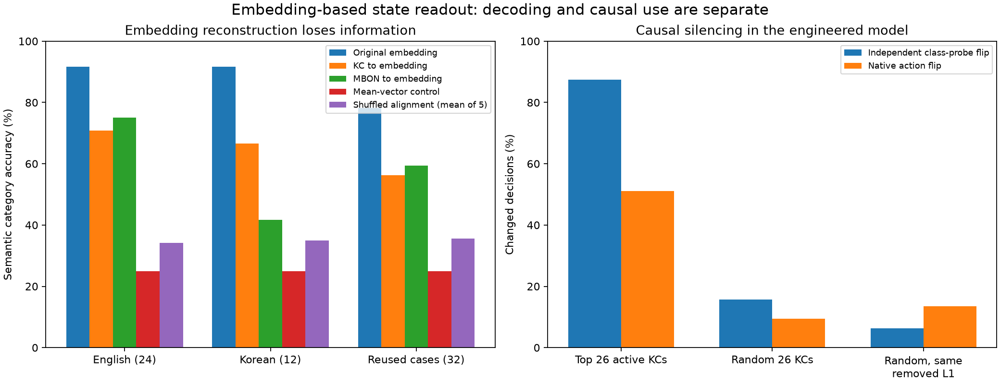

# 동결된 파리 영감 브리지의 의미 readout

## 결과의 경계

이 실험은 **언어가 구동한 시뮬레이션 활동에서 저자가 작성한 의미 설명을 decode**했다. 실제 파리를 기록하거나, 주관적 경험을 복원하거나, neuron에서 자유 텍스트를 생성하거나, 내적 언어를 입증하지 않았다. 파일명의 `thought`는 실험 이름일 뿐이며 실제 측정 대상은 frozen EmbeddingGemma가 공급하고 고정된 connectome-constrained input-to-KC 변환을 통과한 의미 정보다.

설계 근거는 [THOUGHT_RESEARCH.ko.md](THOUGHT_RESEARCH.ko.md)에 있다. 더 큰 hunger–benefit–cost 실험, 행동 state switch, 실제 신경 기록 테스트는 아직 수행하지 않았다.

코어 API와 기본값은 바뀌지 않았다. Decode와 intervention 동안 모든 모델 weight는 동결했다. 평가 split은 이전 저장소 실험에서 이미 사용했으므로 새로운 외부 benchmark가 아닌 호환성 진단이다.



Machine-readable 개요: [summary.json](../../results/thought-bridge/summary.json). Vector figure는 [semantic-readout.svg](../../results/thought-bridge/semantic-readout.svg)다.

## 파이프라인

```text
입력 텍스트
  -> frozen EmbeddingGemma-300m, 128차원 MRL embedding
  -> signed 256-port 표현, 319 input port로 padding
  -> 고정 PN-to-KC 변환
  -> native 2% top-k: KC 5,177개 중 104개 활성
  -> 입력 embedding 128차원을 복원하는 ridge
  -> 미리 작성한 후보 설명 40개에서 cosine 검색
```

후보 catalog는 water, food, warmth, rest 네 필요에 대한 영어/한국어 설명 32개와 unsupported-state distractor 8개다. 후보는 평가 전에 작성하고 embedding했다. Cosine은 유사도이며 확률이나 calibrated confidence가 아니다. Decoder에는 calibrated rejection 규칙이 없다.

Aligned semantic decoder는 `(KC activity, original frozen input embedding)` 32쌍으로 ridge `lambda=0.1`을 학습했다. 네 개 class label에 직접 fitting한 모델이 아니다. 복원된 embedding과 가장 가까운 후보가 description과 catalog category를 제공한다.

대조군은 서로 다른 질문에 답한다.

- `raw_embedding`: frozen 입력 embedding을 직접 nearest-description 검색한 encoding-only ceiling
- `mean_embedding`: 모든 사례에 같은 training mean embedding을 쓰는 no-information reference
- `shuffled_*`: KC–embedding pairing을 섞어 학습한 ridge 5개로 정렬의 필요성을 검사

## 의미 category decoding

| Decoder | 기존 영어 test 24건 | 기존 한국어 test 12건 | 재사용 confirmation 32건 |
|---|---:|---:|---:|
| Raw frozen embedding | 91.67% | 91.67% | 78.13% |
| KC → aligned embedding ridge | 70.83% | 66.67% | 56.25% |
| Learned MBON rate → aligned embedding ridge, 사후 | 75.00% | 41.67% | 59.38% |
| Mean-embedding control | 25.00% | 25.00% | 25.00% |
| Shuffled-pair ridge 5개의 평균 | — | — | 35.63% |
| Shuffled-pair ridge 5개 중 최대 | — | — | 50.00% |

Aligned decoder는 frozen embedding에 이미 있던 category 정보 일부를 유지했지만 raw input보다 성능이 크게 낮았다. Confirmation 56.25%는 shuffled 5개의 평균 35.63%보다 높지만 shuffled 한 실행은 50%였다. Shuffled seed 5개는 작은 경험적 null이며 유의성 검정이 아니다.

원 입력 embedding에 대한 aligned decoder의 평균 cosine은 영어 0.8214, 한국어 0.8370, confirmation 0.8091이었다. Constant-mean control도 0.7606, 0.7632, 0.7489의 높은 cosine을 보였지만 category 정확도는 25%였다. 따라서 이 embedding 공간에서 높은 cosine만으로 성공을 판단하면 안 된다.

### Catalog identity 진단

사후 진단은 알려진 catalog에서 입력과 정확히 일치하는 행을 찾을 수 있는지 검사했다. 자유 텍스트 복원이 아니다. Aligned decoder의 exact catalog identity는 영어 37.50%, 한국어 58.33%, confirmation 40.63%였고 mean control은 4.17%, 8.33%, 3.13%였다. 폐쇄된 catalog 안에서 일부 case-specific structure가 유지됐음을 보여 준다.

평가한 decoder는 unsupported-state 후보를 선택하지 않았다. 이는 OOD rejection 증거가 아니다. Calibrated threshold가 없고 unknown state coverage를 검증하지 않았기 때문이다. Zero hidden vector는 의미 category로 강제 분류하지 않고 명시적으로 `no_signal`을 반환한다.

### 사후 MBON-stage reconstruction

후속 대조군은 learned KC-to-MBON weight 뒤이자 output gain과 action aggregation 전인 96개 MBON-like rate에서 같은 reconstruction 질문을 검사했다. 같은 32개 `(MBON rate, input embedding)` training pair에 별도 ridge map을 동일한 고정 `lambda=0.1`로 피팅했으며 hyperparameter tuning은 하지 않았다. Training row 93.75%, 영어 test 24건 75.00%, 한국어 test 12건 41.67%, 재사용 confirmation 32건 59.38%였다.

이 결과는 학습된 readout stage 뒤에도 입력 의미를 decode할 수 있음을 보여 준다. Target은 여전히 공급된 input embedding이다. 독립적으로 측정한 intent, expected value, decision variable, internal state가 아니다. KC 결과를 본 뒤 추가했고 learned policy checkpoint 하나(seed 601)만 사용했으므로 탐색적이며, 학습이 semantic state를 만들었다고 결론 낼 수 없다.

Trained MBON decoder를 대응하는 untrained MBON rate에 적용하면 confirmation category 정확도는 25.00%로 낮아졌고 reconstructed embedding의 최대 변화는 0.226663이었다. KC activity와 달리 MBON activity는 learned weight에 따라 바뀐다. 이는 fitting된 downstream reconstruction이 weight-dependent임을 보이지만 native policy가 어떤 변수를 사용하는지는 정하지 못한다.

저장된 MBON decoder는 exact round-trip을 통과했다. Regression test가 호환되지 않는 array layout을 찾아낸 뒤 serialization 경로가 C-contiguous array를 요구하도록 고쳐졌고, 테스트가 해당 layout을 명시적으로 검사한다. 이는 artifact 검증이지 과학적 증거가 아니다.

원본: [decoding.json](../../results/thought-bridge/decoding.json).

## Untrained 대조군: encoding과 policy learning 분리

PN-to-KC 변환은 plastic KC-to-MBON readout보다 앞에 있다. 사후 대조군은 같은 고정 input-to-hidden 경로를 가진 untrained native checkpoint를 저장했다.

| 재사용 32건에서 측정한 값 | Untrained 대 trained seed 601 |
|---|---:|
| KC hidden 최대 차이 | 0.0 |
| Semantic decoder 최대 차이 | 0.0 |
| Native policy 정확도 | 21.88% → 50.00% |

Native action 정확도는 바뀌었지만 semantic decoding은 policy 학습 전후에 동일했다. 따라서 의미 신호는 고정 언어/input encoding 경로에 있다. Reward learning이 내부 thought representation을 만들었다는 증거가 아니다. 다른 policy checkpoint도 KC hidden은 동일하며 downstream learned MBON weight만 다르다.

## 별도의 supervised class-probe intervention

인과 intervention에는 embedding reconstruction과 다른 readout을 사용했다. 둘을 혼동하면 안 된다. 별도의 supervised four-class ridge probe를 old training label 32개와 L2-normalized KC activity에 적합하고, probe가 baseline에서 decode한 class에 대한 active KC contribution을 순위화했다.

Active KC `i`와 probe-decoded class `c`의 순위 값은 다음과 같다.

```text
contribution_i,c = hidden_i * class_coefficient_i,c
```

Silencing은 native 2% top-k와 max normalization 뒤에 적용한다. Native MBON policy는 재정규화하지 않은 변경 activity를 받는다. Ground-truth label은 평가 지표에만 쓰고 target 선택에는 쓰지 않았다.

재사용 confirmation input 32개를 downstream policy checkpoint 3개로 반복한 baseline에서 class probe는 65.63%, native policy는 52.08%였다. 기록된 96행은 unique input 32개뿐이다. Input-to-KC feature와 class probe는 checkpoint 사이에 동일하므로 96개 독립 사례나 세 개의 독립 encoder가 아니다.

### Intervention 효과

| Intervention | 변경·제거 유닛 | 제거 activity L1 | Class-probe flip | Native-policy flip |
|---|---:|---:|---:|---:|
| Top contribution, active count 5% | 6개 제거 | 7.02% | 50.00% | 26.04% |
| Random active, 5% count match | 6개 제거 | 5.75% | 9.38% | 4.17% |
| Top contribution, active count 25% | 26개 제거 | 27.47% | 87.50% | 51.04% |
| Random active, 25% count match | 26개 제거 | 24.96% | 15.63% | 9.38% |
| Random, 사후 25% L1 match | 평균 29.22개 변경 | 27.47% | 6.25% | 13.54% |
| Top contribution, active count 50% | 52개 제거 | 52.80% | 100.00% | 57.29% |
| Random active, 50% count match | 52개 제거 | 50.32% | 21.88% | 12.50% |

원래 equal-count 비교는 순위와 제거 activity 크기를 혼입했다. 사후 L1 대조는 25% 조건에서 이 혼입을 직접 다뤘다. Deterministic random 순서로 top-ranked L1 target 근처까지 unit을 완전히 끄고 마지막 하나를 부분 감쇠했다. 평균 제거 L1 27.47%를 정확히 맞춘 뒤에도 top-ranked 조작의 class-probe flip(87.50% 대 6.25%)과 native-policy flip(51.04% 대 13.54%)이 더 컸다.

이는 이 동결된 engineered model에서 supervised probe가 자신의 class와 downstream policy를 강하게 교란하는 유닛 순위를 찾았음을 보여 준다. 유닛이 주관적 thought를 담고 있다는 뜻은 아니다. Target class는 probe에서 나오고, 데이터는 재사용되었으며, L1 match는 초기 결과 뒤 추가되었고, unit 선택과 평가는 한 작은 의미 domain 안에 있다. Policy action 변화도 일반적인 representation 손상일 수 있다. 다음 실험은 training semantic family에서 유닛을 선택하고 분리된 family와 과제에서 효과를 추정해야 한다.

Sparse shadow-forward 확률은 native engine과 최대 절대 오차 `2.98e-8` 이내로 일치했다. 이는 intervention 계산의 수치 검증이며 생물학적 해석의 검증이 아니다.

원본: [interventions.json](../../results/thought-bridge/interventions.json).

## CLI 데모

`thought_embedding.py --text`는 nearest-candidate readout 한 번과 native action probability를 출력한다. 언어를 생성하지 않는다. 기본값은 KC decoder이며 `--stage mbon`은 learned MBON-stage decoder를 선택한다. 저장된 KC smoke demo 결과:

```text
입력: 목이 마르지만 지금은 따뜻한 곳이 더 필요해요.
nearest category: warmth
nearest description cosine: 0.86077
native warmth probability: 0.27683
```

이는 smoke case 한 건이며 benchmark나 confidence-calibrated decision이 아니다. 기록: [demo.json](../../results/thought-bridge/demo.json).

## 실제 파리 실험에 필요한 것

파리의 잠재 상태를 검증하려면 현재 없는 생물학적 paired observation이 필요하다.

1. 식별된 신경 population을 기록하면서 stimulus, movement, choice, outcome, 통제한 internal-state 조작을 함께 측정한다.
2. Cue onset, deliberation, action, outcome에 neural time을 정렬하고 time-causal decoder를 학습하여 선택·보상 뒤 활동이 선택 전 value를 예측하지 못하게 한다.
3. Fly 전체, session 전체, stimulus family 전체를 hold out한다. Preprocessing, unit selection, decoder parameter는 training fold 안에서만 적합한다.
4. Neural decoding을 stimulus-only, movement, choice-history, shuffled-label baseline과 비교한다.
5. 사전 지정한 시간 창에서 후보 neuron을 perturb하고, cue identity는 유지하면서 hunger가 benefit sensitivity를 바꾸는 식의 선택적 행동 interaction을 검증한다.
6. Recovery, state switching, 해부학적으로 matched control neuron을 검사한다.

이 조합이 있어야 sensory reconstruction, movement correlation, 행동에 사용되는 latent state를 구분할 수 있다. FlyWire 경로와 synapse 수는 cell 후보를 제안할 수 있지만 빠진 activity나 motivational state를 제공하지 않는다.

## 이 실행에서 허용되는 결론

- Frozen EmbeddingGemma가 공급된 네 need category를 이미 잘 분리했다.
- 고정된 sparse connectome-constrained KC 표현에는 paired ridge map이 constant 및 평균 shuffled control보다 높은 semantic category를 복원할 정보가 남았다.
- 같은 semantic decoder가 untrained native model에서도 완전히 동일하게 작동하여 정보가 reward learning보다 앞에 있음을 보였다.
- 사후 MBON-stage ridge는 learned rate에서 공급된 입력 의미를 chance보다 높게 decode했지만 untrained MBON rate에서는 실패했다. Target은 독립적인 intent나 value가 아니었다.
- 별도의 supervised class probe가 KC contribution을 순위화했고, 이를 silence하면 count- 또는 L1-matched random control보다 probe class와 native policy가 더 자주 바뀌었다.

이는 소프트웨어 브리지의 semantic encoding과 causal policy dependence를 더 검증할 근거다. 파리의 thinking을 추출한 결과는 아니다.

## 재현

기존 로컬 모델, embedding, checkpoint를 사용한다.

```bash
cd /Users/a405394/fly/nobi
python examples/bio_bridge/encode_thought_descriptions.py
python examples/bio_bridge/thought_embedding.py
python examples/bio_bridge/thought_embedding.py --text '목이 마르지만 지금은 따뜻한 곳이 더 필요해요.'
python examples/bio_bridge/thought_embedding.py --stage mbon --text '목이 마르지만 지금은 따뜻한 곳이 더 필요해요.'
python examples/bio_bridge/thought_interventions.py
python examples/bio_bridge/thought_interventions.py --append-l1-control
python examples/bio_bridge/summarize_thought.py
python -m unittest discover -s examples/bio_bridge -p 'test_thought*.py'
```

Encoder 단계에는 로컬 EmbeddingGemma weight가 필요하다. 이후 decoding, intervention, summary는 저장된 artifact를 재사용한다.
