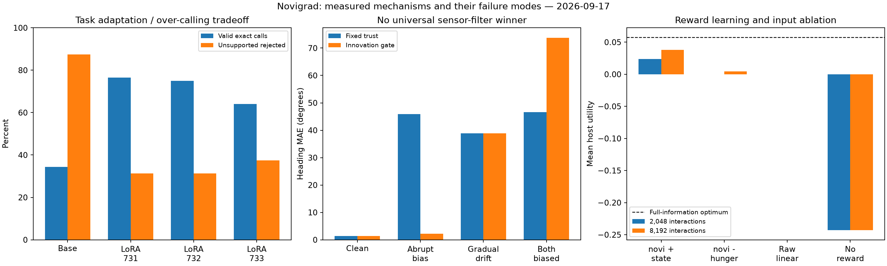
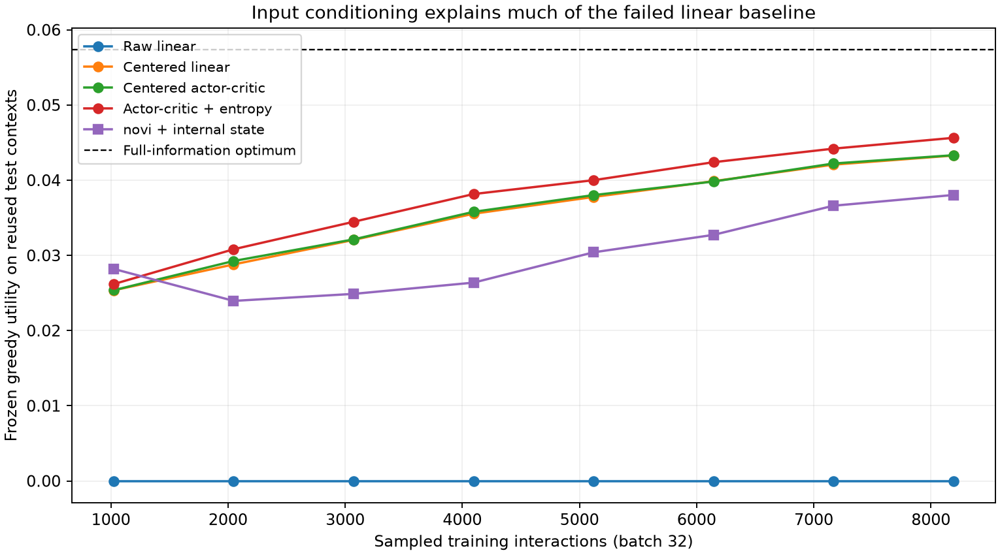

# 목표의 공간 연결·센서 융합·보상 학습 심화 실험

2026-09-17, M2 Ultra에서 현재 대화 중 실행했습니다. [상세 영문 보고서](DEEP_RESULTS.md) · [논문과 후속 실험 설계](DEEP_RESEARCH.ko.md)

이번에는 신경 단계를 추가했을 때 실제 이점이 있는지, 무엇이 실패 원인인지 분리했습니다. 핵심 발견은 **언어 특화 학습의 과도한 호출 문제**, **센서 오차 유형에 따른 필터의 상반된 결과**, **보상 학습에서 입력 표현과 탐색의 중요성**입니다.

## 1. 별도 작성 문항과 세 번의 LoRA 학습

별도 에이전트가 도구 스키마만 읽고 학습 예문은 읽지 않았다고 보고한 새 문항 80개를 작성했습니다. 유효한 요청 64개와 지원하지 않거나 복합·모호한 요청 16개이며 영·한 비중은 같습니다. 기존 학습 76문항과 정확히 같은 문자열은 없습니다. 다만 독립된 사람의 표준 벤치마크는 아니며 간접 표현의 정답에는 해석이 개입합니다.

원본 BF16은 그대로 두고, 동일한 76문항·80스텝·배치 2·rank 8 설정에서 시드 731/732/733을 비교했습니다. 테스트에 맞춘 예문 수정·추가 생성·출력 보정은 하지 않았습니다.

| 모델 | 유효 호출 /64 | 영어 /32 | 한국어 /32 | 미지원 요청 차단 /16 |
|---|---:|---:|---:|---:|
| 원본 | 22 | 15 | 7 | 14 |
| LoRA 731 | 49 | 26 | 23 | 5 |
| LoRA 732 | 48 | 27 | 21 | 5 |
| LoRA 733 | 41 | 22 | 19 | 6 |

유효 호출은 원본 34.38%에서 어댑터 평균 71.88%로 개선됐지만, 미지원 요청이 실행 가능한 다른 호출로 바뀌는 문제가 커졌습니다. 여기서 차단은 파서에 유효한 호출이 남지 않았다는 의미입니다. 원본이 대화문을 출력한 경우도 포함하므로 의도적인 거절 능력과 같지 않습니다.

세 시드는 같은 평가 문항을 사용합니다. 이를 192개의 독립 문항으로 계산하지 않았습니다. 짧은 API 호출 생성의 중앙 지연은 약 0.284–0.301초이며 모델 로딩을 제외합니다. 장문 TPS나 하드 실시간 성능은 아닙니다.

### MAGI식 투표는 충분하지 않았음

동일 평가 출력을 재사용한 탐색적 비교입니다.

- 다수결: 유효 요청 48/64, 미지원 차단 6/16.
- 만장일치가 아니면 보류: 유효 요청 40/64, 미지원 차단 7/16, 유효 요청 17개도 보류.
- 미지원 요청에 상태를 바꿀 수 있는 호출을 내는 경우가 각각 7개·6개 남았습니다.

같은 기반 모델과 같은 학습 데이터에서 시드만 다르게 한 것은 충분한 오류 다양성을 만들지 못했습니다. 기본 실행 경로에 투표기를 설치하지 않았습니다.

## 2. 실제 생성 명령을 이동 환경에 연결

실제로 생성된 원문을 다시 파싱하고, 새 세션에서 native novi를 호출한 뒤, 호스트 지도가 선택된 자원의 위치를 해석하고 몸을 이동시킵니다. 물·음식·보온·휴식 위치를 환경 시드마다 회전시킵니다. 언어 모델 출력은 문항당 한 번 생성하여 환경 시드들에 재사용하므로 매 에피소드 실시간 HTTP 호출을 수행한 실험은 아닙니다.

정답 자원 반경에 들어가야 +1, 다른 자원에 도착하면 −1, 시간 초과·실행 불가능한 명령은 0입니다. 내부 행동 이름이 맞았다는 이유만으로 보상을 주지 않습니다. 이번 물리 실험에서는 정책을 고정했고 가중치가 바뀌지 않았음을 검사했습니다.

| 구성 | 원본 언어: 정상 / 시각 단절 | LoRA 731: 정상 / 시각 단절 |
|---|---:|---:|
| 올바른 목표만 알려주는 비교군 | 100% / 100% | 100% / 100% |
| 목표 ID를 지도에 직접 연결 | 25% / 25% | 70% / 70% |
| novi + 방향 기억 | 25% / 25% | 70% / 70% |
| novi에서 이동량 갱신 제거 | 25% / 24% | 70% / 66.5% |

현재 병목은 목표의 언어 해석입니다. **이 과제에서는 novi를 한 번 더 거치는 이점이 직접 연결보다 높지 않았습니다.** 의미가 이미 확정된 enum을 다시 임베딩하는 단계는 중복입니다. 자원 디코더를 틀리게 연결한 비교군에서는 LoRA 도착률이 0%가 되어 배선 오류도 확인했습니다.

40문항×10환경 시드의 400행은 독립된 물리 실험 400개가 아닙니다. 같은 목표와 시드라면 궤적이 중복되고, 정답 목표 비교군의 서로 다른 물리 조건은 40개입니다. 이를 독립 표본으로 간주한 신뢰구간을 제시하지 않았습니다.

제어 계산만의 중앙/95백분위는 약 9/11마이크로초였습니다. 언어 생성·로딩·센서·물리 계산은 제외합니다. 호스트 위치와 지도는 정확하다고 가정하며 장애물·이동하는 자원·자율 위치 추정·학습된 조향은 없습니다.

## 3. 정답 신뢰도를 주지 않는 센서 실험

20시드×6조건에서 고정 신뢰, 정답 신뢰도 비교군, 초기 시각 보정 후 이동량만 사용, 관측 불일치 필터를 비교했습니다. 마지막 필터는 예측과 시각 관측의 차이가 18도보다 작으면 수용하고 35도 이상이면 버립니다.

| 조건 | 고정 신뢰 방향 MAE | 불일치 필터 MAE |
|---|---:|---:|
| 정상 | 1.42° | 1.42° |
| 시각 단서가 갑자기 틀어짐 | 45.89° | 2.20° |
| 시각 오차가 천천히 증가 | 38.86° | 38.86° |
| 시각·이동량이 함께 틀림 | 46.57° | 73.72° |

이것은 학습된 신뢰도가 아닌 정해진 이상치 제거 규칙입니다. 천천히 틀리면 감지하지 못하고, 이동량이 틀리면 올바른 시각 보정을 거부할 수 있습니다. 전체 평균의 개선만으로 보편적 우월성을 주장할 수 없습니다. 해당 필터를 전역 기본값으로 바꾸지 않았습니다.

## 4. 배고픔과 실제 행동 보상으로 학습

실제 PN→KC→MBON 연결을 사용하는 Engine에 배고픔·이득·혐오 비용을 공학적인 319개 비음수 입력으로 넣었습니다. 접근 보상은 `배고픔×이득−비용`, 회피는 0입니다. 정책이 행동을 샘플링하고 선택한 행동의 보상만 받습니다. 생물학적 감각 부호화나 실제 도파민 회로의 재현은 아닙니다.

각 시드는 같은 초기 연결 구조의 새 모델로 시작하고 데이터·행동 샘플링을 달리했습니다. 서로 다른 무작위 해부학적 연결망 세 개는 아닙니다. 배고픔 제거 비교군도 같은 학습 모델의 입력만 바꾼 것이 아니라 별도로 다시 학습한 모델입니다. 짧은 예산은 **2,048회 상호작용/64회 배치 업데이트**, 긴 예산은 8,192회/256회입니다. 두 예산은 같은 시험 시드를 사용하므로 긴 예산 비교는 탐색적으로 표시했습니다.

| 정책 | 짧은 예산 평균 보상 | 긴 예산 평균 보상 |
|---|---:|---:|
| 내부 상태 포함 novi | 0.02395 | 0.03803 |
| 배고픔 제거 novi | 0 | 0.00445 |
| 처음의 선형 정책 | 0 | 0 |
| 무보상 novi | −0.24290 | −0.24290 |
| 무작위 행동 | −0.12314 | −0.12314 |
| 배고픔을 모르는 분석적 최적 규칙 | 0.04243 | 0.04243 |
| 모든 정보를 아는 최적 규칙 | 0.05738 | 0.05738 |

학습 효과와 상태 입력의 효과는 있지만 아직 최적화 부족이 큽니다. 학습 전 novi는 접근 쪽으로 편향돼 있으므로 무보상 모델은 무작위 정책과 다릅니다. 무보상 가중치 불변을 확인했고 실제 Engine 체크포인트는 Safetensors와 체크섬으로 저장했습니다.

### 같은 학습 모델의 입력만 바꾸는 추가 검증

긴 예산으로 학습한 동일 체크포인트를 고정하고 배고픔 입력만 0.5로 고정하거나 문항 간에 섞었습니다. 보상 평가는 원래 환경 상태를 유지했습니다. 평균 보상이 **0.03803 → 0.02008 / 0.01819**로 떨어졌고 행동은 각각 8.12%·9.55% 바뀌었습니다. 가중치와 체크섬은 그대로입니다. 별도 재학습 비교군과 구분되는, 실제로 배고픔 채널을 유익하게 사용했다는 소프트웨어 수준의 증거입니다. 같은 시험 문항을 다시 쓴 탐색적 개입이며 생물학적 검증은 아닙니다.

### 선형 정책 실패 원인을 추가로 분리

보상을 더 주는 것보다 입력 표현을 바꾸는 것이 중요할 수 있음을 확인했습니다. 같은 8,192회 예산, 세 시드, 같은 시험 문항을 재사용한 고정 설정 탐색 결과입니다.

| 선형 학습 방식 | 평균 보상 | 최적 대비 손실 |
|---|---:|---:|
| 원래 입력 + REINFORCE | 0 | 0.05738 |
| 중심화·스케일링 + REINFORCE | 0.04328 | 0.01410 |
| 중심화 + actor-critic | 0.04332 | 0.01406 |
| actor-critic + 엔트로피 0.02 | 0.04563 | 0.01175 |

주된 개선은 입력 조건화에서 나왔습니다. 학습한 가치 기준선은 거의 차이가 없고 탐색을 유지하는 엔트로피 항은 추가 이득이 있었습니다. 개선된 일반 정책은 novi보다 높았습니다. 따라서 초기 선형 정책 실패를 생물학적 구조의 우수성으로 해석하지 않았습니다.

## 5. 남긴 결과와 다음 방향

[원시 결과·체크섬·그림](../../results/function-bridge-deep)과 [영문 재현 명령](DEEP_RESULTS.md)에 실행 과정을 남겼습니다. 원본 모델은 유지되고 어댑터·Engine 가중치는 로컬 Safetensors로 저장됩니다. Git에는 코드·설정·결과·검증 정보를 보관하며 모델 가중치는 제외합니다.

다음 우선순위는 명시적인 보류/재질문 동작과 새로운 미지원 요청 평가, 독립적인 센서 기준점, 없는 목표·움직이는 목표, novi 내부의 입력 조건화와 탐색 방식 비교입니다. 2026년 후각 연구까지 포함한 논문 검토는 FC2·hΔK·EPG·PFL을 보편적인 “전두엽”으로 묶지 않고, 목표 기억·현재 방향·행동 변환을 구분합니다. 이번 세 실험 묶음은 그중 일부 공학적 가설을 시험한 것이며, 실제 신경 집단의 동역학을 구현한 것은 아닙니다.
