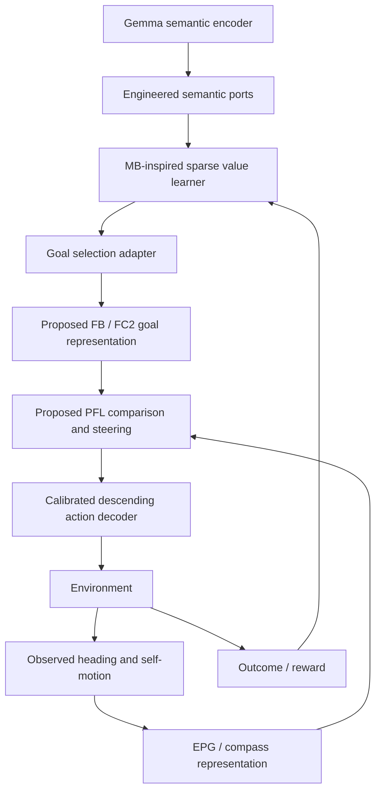

# Where should a language bridge enter a fly-inspired engine?

Research and implementation review, 2026-09-17. The recommendation is a **split semantic/value and goal/heading interface**, not a single region labelled “fly prefrontal cortex.” The demonstrated code currently implements the semantic/value part only. No living animal or brain interface is involved.

## Evidence and design implications

| Candidate | Primary evidence | Implication for novi | What the evidence does not establish |
|---|---|---|---|
| Mushroom body (MB), Kenyon cells and MB output neurons | MBON activity and interventions link experience-dependent valence to behavioral choice. [Aso et al., 2014](https://elifesciences.org/articles/4580) | Use sparse representations and learned value/action readout; connect feedback to learning. | Language representations do not naturally correspond to odors or specific ALPN IDs. |
| Fan-shaped body (FB) and central complex (CX) | CX connectivity includes recurrent navigation circuits and routes for internal-state/context modulation. [Hulse et al., 2021](https://elifesciences.org/articles/66039) | Keep goals, internal state and directional state in separate ports; recurrence is important. | A connectome alone does not specify firing dynamics, synaptic efficacy or a universal executive module. |
| FC2 and EPG populations | FC2 activity tracks goal angle; EPG tracks heading. FC2 stimulation affects orientation; PFL3 combines these inputs. [Mussells Pires et al., 2024](https://www.nature.com/articles/s41586-023-07006-3) | A goal-angle adapter is a concrete later intervention target. Heading must come from the environment, not be replaced by the language goal. | FC2 does not encode arbitrary text or general human-style plans. |
| PFL3/PFL2 and descending output | Physiology and perturbations connect PFL3 populations to lateral steering and PFL2 to steering vigor. [Westeinde et al., 2024](https://www.nature.com/articles/s41586-024-07039-2) | Decode separate steering direction and magnitude downstream of the heading–goal computation. | Neuron name or soma side alone does not prove left/right motor semantics. |
| MB → FB pathways | Anatomical/functional studies support convergence of learned and innate odor-related signals with navigation inputs. [Scaplen et al., 2021](https://elifesciences.org/articles/63379), [Matheson et al., 2022](https://www.nature.com/articles/s41467-022-32247-7) | Connect learned value to contextual goal selection; audit actual paths before wiring. | Every MBON is not a motor command; a direct universal MBON→FC2 connection must not be invented. |
| Whole-brain annotation | FlyWire annotates cell classes and highlights variation between brains, including KC populations. [Schlegel et al., 2024](https://www.nature.com/articles/s41586-024-07686-5) | Use versioned root IDs and cell types; retain annotation provenance. | Hemibrain body IDs and FlyWire root IDs are not interchangeable. |

These are functional analogies and engineering design choices. There is no basis here to label one fly neuropil an anatomical human prefrontal lobe or claim that attaching an LLM grants a fly circuit human executive functions. Different computations are distributed across interacting regions. An emerging integrated brain-and-cord dataset also motivates examining distributed feedback rather than assuming a single central command chain; it is a different dataset from the pinned FlyWire v783 used here. [Distributed control circuits, 2026](https://www.nature.com/articles/s41586-026-10735-w)

## Proposed interface

Only `L → A → M → discrete action` is implemented and evaluated. The diagram's FC2/EPG/PFL section is a research design, not a claim that the current example simulates these neurons. No goal direction can be inferred from “find water” without grounding: a scene/map or exploration policy must identify where water is. An embedding similarity score is not a spatial coordinate.

The existing engine is a two-layer feed-forward ALPN→KC→MBON rate model. It does not implement CX recurrence, attractor maintenance, compartment-specific dopamine, natural MBON motor decoding, or biophysical spike dynamics. In particular, it groups output cells into four engineered actions and the opponent gains are a software decoder. Replacing IDs with FC2/PFL IDs would not create the missing computations.

The present 128-dimensional semantic adapter splits each signed coordinate into positive/negative channels and pads to 319 ALPN ports. This is an artificial stimulation convention: it preserves the truncated vector, but the first 128 coordinates discard information from the original 768-dimensional embedding. Channel order is positional in the engine's `input_ids`; it carries no demonstrated olfactory meaning. The encoder is fixed and reward changes only the existing plastic readout.

## Anatomy audit before implementation

`anatomy.py` scans the local sparse graph and annotation table to find candidate cells and actual edges. Its output `results/gemma-bridge/anatomy.json` must be read with its selection rules: exact cell-type matches differ from prefix-based candidates. Pair counts and synapse counts are structural observations. Paths through the retained graph are not causal evidence of behavior, and absence from a filtered export is not absence in the animal.

The next implementation should retain separate explicit signals: `semantic_state`, `goal_bearing`, `heading`, `angular_velocity`, `need_state`, `reward`, and `steering_output`. Only the relevant adapter may write a population's input. Store root IDs, evidence, coordinate conventions and scaling in a versioned port manifest. Test interventions by disabling goal input, scrambling heading, lesioning proposed output pathways and comparing to an ordinary heading-error controller.

## Experiment sequence and decision gates

1. **Current semantic bridge:** frozen embeddings, reward-only novi versus a same-input linear policy, held-out English and Korean, shuffled reward, save/reload. This establishes that information can cross the interface and that reward matters.
2. **Adaptation:** change actuator meaning without resetting learned weights. If the policy cannot recover, inspect exploration, saturation and learning timescales before expanding anatomical scope. A baseline with no exploration failed this test; the failure is retained in the report.
3. **Grounded goal interface:** map a selected need to an observed target and its world-relative bearing. Evaluate random initial headings, distractors, missing landmarks and target switches in a simple navigation task.
4. **CX-inspired dynamics:** implement persistent heading and goal populations with explicit time evolution, first against analytic controls. This is a functional model, independently distinguished from a connectome-constrained implementation.
5. **Anatomical constraints:** map the audited cells/edges, validate directional phases from synapse locations/morphology, and compare ablations and perturbed connectivity. Do not report a biological advantage unless the matched controls support it.

Quality gates should cover end-to-end success, reversal recovery, unseen language, long-run state stability, memory, warm/cold latency and matched compute. Independent new prompts and more seeds are required after exploratory tuning. The tiny bandit is not a navigation game, reasoning benchmark, or evidence of consciousness; it is a useful first integration test.

## Open uncertainties

- Which specific MB→FB intermediates in this export transmit relevant learned value? Cell-type labels can identify candidates but not the actual task-specific code.
- Can a small adapter ground language goals without bypassing the neural controller with a hidden symbolic solution?
- Do recurrent CX constraints help adaptation or merely add compute relative to a simpler controller?
- How should compartment-specific reward, negative outcomes and exploration interact? The current global policy gradient is an algorithmic approximation.
- How much of observed performance is already present in frozen Gemma embeddings? Nearest-example and linear controls are essential.

[한국어 요약](RESEARCH.ko.md) · [Executed experiment](README.md)

## Measured local structural candidates

The v783-derived annotation/edge audit finds 96 MBONs, 47 EPG, 85 FC2 (17 FC2A / 28 FC2B / 40 FC2C), 12 PFL2, 24 PFL3 and 1,303 descending neurons. A broader CX/tangential annotation filter yields 609 candidates; this is an operational filter and includes ambiguous/blank types, not an independent anatomical confirmation that every cell is FB tangential.

| Directed candidate relation | Recorded synapses |
|---|---:|
| MBON → CX tangential candidates | 3,854 |
| CX tangential candidates → PFL3 | 7,109 |
| FC2 → PFL3 | 2,470 |
| EPG → PFL3 | 671 |
| PFL3 → descending | 3,427 |
| EPG → FC2 | 1 |

These measurements support auditing **separate heading and goal inputs converging on PFL3**; they do not support inventing a strong EPG→FC2 direct channel. The broad MBON→tangential→PFL→descending graph contains 102,872 path instances, a combinatorial count rather than an effective signal strength. The generated JSON retains source file hashes, selection rules, sign counts and example paths. Directional phases and causal gains remain uncalibrated.
