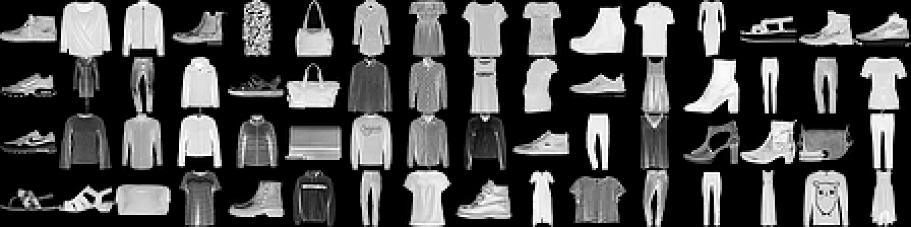
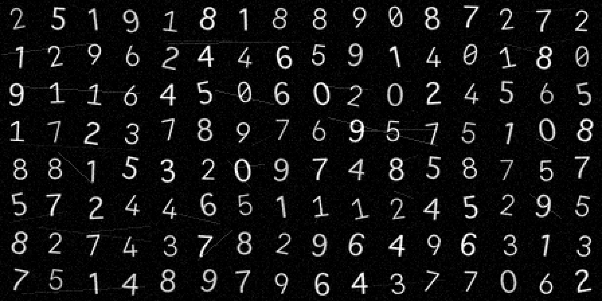

# Image tasks on the Bionic NPU

[한국어](README.ko.md) · [Measured results](../../results/VISION_REPORT.md)

The same Rust engine learns ten clothing categories and digits in locally generated CAPTCHA images. An interchangeable Python adapter converts pixels into the circuit's input rates. The release models achieve 72.62% mean clothing accuracy, 83.32% digit accuracy, and 48.67% exact four-digit success across three training seeds. These are research examples with useful failures, not production OCR.




## Run a released model

From the repository root, install the dependencies and build the Rust binaries:

```sh
python3 -m venv .venv
.venv/bin/pip install -r requirements-vision.txt
cargo build --release --bins
```

Download `novigrad-v0.1.0-models.tar.gz` from the [release](https://github.com/ziozzang/novigrad/releases/tag/v0.1.0), and extract it at the repository root. The archive populates `examples/vision/models/` and `models/connectome/`. Inference needs no raw FlyWire or Fashion-MNIST download; topology and weights are self-contained in the checkpoints.

```sh
tar -xzf novigrad-v0.1.0-models.tar.gz
.venv/bin/python scripts/predict_image.py \
  examples/vision/models/fashion/bundle.json examples/vision/assets/fashion-example.png
.venv/bin/python scripts/predict_image.py \
  examples/vision/models/captcha/bundle.json examples/vision/assets/captcha-example.png
```

The first example's true class is `Shirt`, but this model predicts `T-shirt/top`. The second predicts the correct `5420`. Both images are predetermined test sample 0, not selected for success. Output includes every class probability. Fashion takes one image, converts to grayscale and resizes to 28×28. CAPTCHA requires a 112×28 image with four known 28×28 cells. Inputs should have a dark background and bright foreground; use `--invert` for the opposite polarity.

A prebuilt Apple Silicon executable can be selected with `--binary PATH/TO/classify_features`.

## Reproduce training

```sh
.venv/bin/python scripts/run_vision_examples.py
.venv/bin/python scripts/report_vision.py
.venv/bin/python scripts/verify_safetensors.py \
  examples/vision/models/fashion/model.safetensors \
  examples/vision/models/captcha/model.safetensors \
  --report results/vision-safetensors-verification.json
```

The runner downloads and verifies source data, prepares the FlyWire subcircuit, creates deterministic image splits, fits adapters using training images only, and trains seeds 1–3 plus a shuffled-label control. It selects checkpoints on validation, then evaluates test data. `--skip-prepare` reuses local inputs; `--task fashion` or `--task captcha` runs one task. The first specified seed is packaged, never the seed with the best test score.

Dataset generation defaults to macOS `SFNSMono.ttf` and `Geneva.ttf`. Font binaries are not distributed. `scripts/prepare_vision.py --help` lists font options for other machines; changing fonts creates a different experiment. Numerical results can also vary with BLAS and CPU implementations. See [dataset hashes and font provenance](../../results/vision-data-manifest.json).

## Absorbing another modality

The adapter uses HOG and pooled pixels, training-only feature scaling and PCA, then maps signed components to nonnegative input rates. It reads no labels during fitting or inference. The engine receives ordinary rates and has no image-specific branch. The external output decoder uses fixed opponent gains; the actual circuit topology and synapse signs are preserved.

To add a task, supply a dataset Safetensors file with `input_ids: U64[D]`, `train_inputs`, `validation_inputs`, `test_inputs: F32[N,D]`, and corresponding `*_labels: I64[N]`. Rates must be finite and input IDs must match the graph's sorted input ports. Invoke `train_classifier` with two edge tables and the action count. `--phase tune` evaluates validation only. `classify_features` loads a checkpoint and accepts label-free `inputs` and `input_ids` tensors. See the [architecture](../../docs/architecture.md) and [model format](../../docs/model-format.md).

Published vision runs use supervised teacher gradients. Reward learning is validated separately by the binary/four-way/XOR experiments; successful bandit-only image training is not claimed here. Fashion-MNIST covers clothing categories, not scene detection. Synthetic CAPTCHA covers known cell positions and the generator's font/noise distribution, not arbitrary websites or unseen segmentation.
