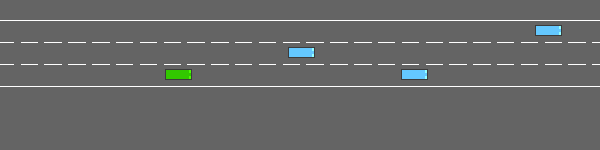

# Closed-loop driving game: learning a simple survival behavior

Novigrad learned a useful **simple response to this game's reward**: slow down and hold speed. On twenty held-out simulator seeds, the selected checkpoint reduced collisions from 15/20 to 1/20 and increased mean return from 22.20 to 27.95. This is reward-based closed-loop learning without expert action labels. It is not evidence of complex evasive driving or autonomous discovery of arbitrary game objectives: an additional always-slow rule had zero collisions and slightly higher return.

## Measured comparison

All primary policies used the same twenty test seeds, 20000–20019. Greedy action selection was used for learned/frozen/control policies; random chose uniformly.

| Policy | Mean return | Collisions | Mean distance | Mean speed |
|---|---:|---:|---:|---:|
| Learned, selected on validation | 27.95 | 1/20 | 394.41m | 20.48m/s |
| Frozen initial model | 22.20 | 15/20 | 331.64m | 24.80m/s |
| Unrelated-feedback training | 22.20 | 15/20 | 331.64m | 24.80m/s |
| Uniform random actions | 16.92 | 15/20 | 253.44m | 24.91m/s |
| Always idle | 22.20 | 15/20 | 331.64m | 24.80m/s |
| Always slower, post-hoc diagnostic | 28.67 | 0/20 | 403.00m | 20.08m/s |

The learned policy issued 575 idle and 198 slower commands across 773 test decisions; it issued no left/right/faster commands. Its initial model selected idle throughout. The change is therefore real but simple: reinforcement found a conservative speed policy. HighwayEnv's stock discrete speed controller has a 20 m/s minimum target, so repeated slower commands do not bring the vehicle to a complete stop.

The always-slower baseline was added after inspecting the learned action counts. It is explicitly a post-hoc diagnostic; no checkpoint or parameter was changed from this result. The reproduction runner now includes it by default. The learned model does not beat this rule, so the result should not be described as sophisticated traffic reasoning.

Evidence: [primary results and every test episode](driving-game/summary.json), [always-slower diagnostic](driving-game/posthoc_slow_baseline.json), [validation selection](driving-game/selection.json), [learning-rate 0.01 history](driving-game/lr0.01/training.json), [learning-rate0.05 history](driving-game/lr0.05/training.json), [unrelated feedback](driving-game/unrelated/training.json).

## Initialization and evaluation discipline

Each independent candidate starts with a new `Engine::load` of the same real PN→KC→MBON topology. The two learning-rate candidates' fourteen initial Safetensors tensors are byte-value equivalent, including plastic weights and output gains; only configuration metadata such as learning rate differs. The unrelated-feedback run starts from the selected candidate's **initial** checkpoint, not its trained checkpoint ([verification](driving-game/verification.json)).

The simulator resets road and traffic for every episode. Learned weights persist within one training run. Four episodes collect transitions with weights frozen, then one mean-gradient update changes the plastic weights. The baseline is maintained only within that training run. Engine inference is feedforward; it does not carry a recurrent hidden state across games.

Training seeds are 1000–1127. Validation seeds 10000–10007 select among the initial checkpoint and checkpoints after 32, 64, 96, 128 episodes. Two predeclared learning rates, 0.01 and 0.05, are compared; the learning-rate 0.01 model at episode 96 wins. All models and the unrelated control are trained/selected before primary test evaluation on seeds20000–20019. **No learning occurs during validation or test games.** The selected checkpoint is fixed across all twenty test seeds.

Later training was not consistently better: the 0.01 run's validation collision rate was 0% at episode 96 but 75% at 128. Checkpoint selection therefore matters; the report does not substitute the final weights for the best validation checkpoint. This is one training RNG seed and a small validation set, so robustness across independent training runs is unmeasured.

## What the policy observes and learns

The external simulator is [Farama HighwayEnv](https://highway-env.farama.org/environments/highway/), installed as highway-env 1.12.1 with Gymnasium 1.3.0 and pygame-ce 2.5.8. This run uses `highway-fast-v0`, three lanes, twelve NPCs plus the controlled car, 20-second episodes, 2 Hz decisions, and 10 Hz vehicle integration. The fast variant skips NPC-to-NPC collision checks. The [fixed configuration and encoder](../scripts/driving_environment.py) preserve the stock environment rather than supplying a correct-action oracle.

The observation is a 5×5 normalized kinematic array: presence, x, y, vx, vy for the ego car and nearby vehicles. Signed positive/negative channels are repeated across 318 ports and a constant final port completes the 319-rate input. No reward, collision flag, expert action, or simulator info dictionary enters this encoder. These structured object states are privileged compared with a raw camera; the example is a decision-learning task, not an end-to-end vision driver. HighwayEnv's low-level controller performs steering and speed tracking for the five meta-actions.

The runner samples actions from the engine's own probabilities. It records rewards and computes discounted returns with gamma 0.97. Subtracting a previous-batch time-indexed exponential moving average provides the baseline; post-terminal returns are zero padded. Advantages are divided by 10 and clipped to [-1,1], then passed to the existing API's mean reward-gradient update. The baseline updates with coefficient 0.1 after the gradient batch. Clipping is an engineering stabilization, so this is a bounded-advantage REINFORCE-style update. No pretrained policy or teacher labels are used.

This reuses the Rust core's reward-modulated gradient, but computes episode returns in the Python runner rather than using the separate `DelayedReward` wrapper. It is inspired by a signed reward signal, not a claim of biological dopamine fidelity. The control randomly permutes these advantages across observations/actions within each batch, retaining their marginal distribution while disrupting their relationship; chance correlations remain possible.

## Goal discovery is bounded by the reward

The environment defines a scalar objective. With speed_score=clip((forward_speed−20)/10,0,1), on-road normalized reward is `(1 − crashed +0.4×speed_score)/1.4`. A safe slow step still gives about 0.714, while a crash terminates the episode. This creates a straightforward survival incentive. Learning discovers how actions affect that score; it does not infer that “driving safely” is a semantic objective independent of the score. See the publisher's [reward design discussion](https://highway-env.farama.org/rewards/).

This matters for future work: a more demanding game should make constant slow/idle rules insufficient and evaluate progress as well as collisions. Novelty or curiosity could encourage exploration, but their definitions would remain designed reward mechanisms. No claim of self-invented goals, transfer to arbitrary games, or real-world vehicle safety follows from this experiment.

## Runtime, artifacts, and reproduction

The three training runs took 26.80, 29.75, 26.92 seconds respectively on the M2 Ultra, including periodic validation but excluding installation/build and final test evaluation. A separate playback of the first test seed ran 40 decisions without collision; observation encoding, API inference, and simulator stepping averaged 11.65 ms and peaked at 13.19 ms, versus a 500 ms policy period. This is unpaced offscreen execution, not a hard real-time camera-to-actuator measurement ([playback record](driving-game/playback.json)).

The selected engine is saved locally at `results/driving-game/model.safetensors`. Reproduction produces it from topology and rewards; pretrained models are not embedded in the source repository. A 40-frame GIF was rendered offscreen and visually checked. The initial black rendering under SDL's dummy driver was corrected by unsetting that driver; learning/evaluation results were unchanged. [Code/binary/model hashes and corrections](driving-game/verification.json) accompany the results.

Tests passed: 35 Rust tests, 12 Python tests, Clippy, and formatting. The new `novi_engine init` integration test checks model configuration, output gains, reload, and refusal to overwrite. [Run or watch the game](../examples/driving-game/README.md).
