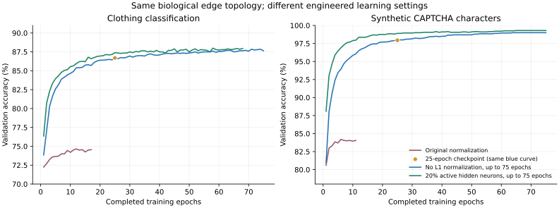

# Novigrad v0.1.1: learning mechanisms and fresh holdout results

[한국어 보고서](IMPROVEMENT_REPORT.ko.md)

The same anatomical input/plastic edges now support substantially stronger image recognition. No pretrained CNN/OCR or new dense layer was added. The selected configuration disables per-output L1 normalization, trains for up to 75 epochs with validation early stopping, and retains 20% of hidden neurons. Synapse signs and individual weight bounds remain enforced. The engine default remains unchanged; these are explicit task configurations.

## Final comparison on previously unused data

| Metric | Released v0.1.0 model, same new holdout | Improved mean, 3 seeds | Improved seed range | Shuffled-label control |
|---|---:|---:|---:|---:|
| Clothing accuracy (8,000 images) | 71.20% | **85.04%** | 84.82%–85.26% | 9.24% |
| CAPTCHA character accuracy (4,000 cells) | 83.50% | **99.49%** | 99.48%–99.50% | 12.53% |
| Exact 4-digit success (1,000 images) | 49.20% | **98.00%** | 98.00%–98.00% | 0.00% |

The baseline column evaluates the packaged v0.1.0 seed-1 model on these same new images. It is not the old published three-seed average on the earlier 2,000/500-image tests. Improved models use seeds 1, 2, 3 on one fixed split; their range describes optimizer/order variability, not uncertainty across different datasets. Seed 1 is packaged regardless of test score.

Mean test cross-entropy changes from 1.512 to 0.431 for clothing, and 1.633 to 0.064 for digits. Better argmax accuracy and loss do not establish calibrated confidence or robustness to distribution shifts.

## Eight controlled configurations

Every tuning row used seed 1 and validation only. Each configuration was applied to both tasks; `--phase tune` left test metrics null and wrote no test predictions. [Full ablations](improvement/ABLATIONS.md) include cross-entropy, true-class probabilities, selected epochs, zero-weight fractions and output L1 mass. [Machine-readable configurations and statistics](improvement/ablation-summary.json) preserve every result, including failures.

| Change | Fashion validation | CAPTCHA validation | Interpretation |
|---|---:|---:|---|
| Original 25-epoch setting | 74.65% | 84.20% | Baseline reproduced exactly |
| Disable output L1 normalization | 86.70% | 97.95% | Largest single tested improvement |
| Keep normalization, gain 12→48, inverse-scale learning rate | 85.75% | 95.55% | Evidence scale and resulting gradients matter too |
| No L1 normalization, up to 75 epochs | 87.85% | 99.00% | Additional passes help the undertrained model |
| Retain 20% instead of 10% hidden cells, 75 epochs | 88.00% | 99.30% | Selected for both tasks |
| PCA 96 instead of 64, top 10%, 75 epochs | 87.60% | 98.50% | More dimensions did not help |
| Batch 16, lr 0.0016, top 10%, 75 epochs | 87.85% | 99.00% | Same accuracy as matched online training |
| Batch 64, lr 0.0064, top 20%, 75 epochs | 87.95% | 99.15% | Slightly below matched online training |

The 25-epoch no-normalization run and its longer version share the same initial trajectory; the orange marker identifies the shorter run. These are validation curves, not fresh test curves.

## Why these changes matter

With per-output normalization, each MBON has an incoming absolute weight budget of 1. After an online update exceeds that budget, all incoming weights are divided by their total, creating competition among previously and currently useful connections. Removing that rescaling permits a larger and nonuniform evidence budget while still clipping each existing edge to its original sign and magnitude bound. On seed-1 validation checkpoints, mean output L1 grows from about 0.99 to 5.56/6.62 after 25 epochs (clothing/digits), accompanied by much stronger true-class probabilities. This is an engineering result, not proof about physiological homeostasis.

Gain alone cannot change the argmax of a fixed trained model. Here the gain control retrained the network: even with learning_rate × gain held constant, softmax changes the error term and therefore the gradient. Its improvement shows that output scale is part of the bottleneck. The experiment does not uniquely separate all effects of scale, normalization and optimization.

Extra epochs help because the no-normalization learning curves are still improving at epoch 25. Validation selects the checkpoint, so a later worse epoch is not forced into the model. Retaining more hidden cells gives a smaller additional benefit. More PCA dimensions simultaneously alter compression and how components repeat across 319 ports, so their negative result is not evidence that dimensionality is universally harmful.

Minibatch accumulation is kept as a reusable library/CLI capability, not advertised as an accuracy win. Batch size 1 keeps the original online path; larger batches average gradients and apply projection once. Learning rates in these experiments were explicitly scaled to roughly preserve update magnitude per epoch. Other batch/rate combinations remain untested.

## Data and selection discipline

- Training data remains 10,000 clothing images and 3,000 four-digit CAPTCHA images, with the original 2,000-image and 500-string validation sets.
- The new Fashion holdout contains the remaining 8,000 official test indices excluded from the earlier release evaluation. CAPTCHA has 1,000 new strings excluded from all original train/validation/test strings, generated with a separate seed.
- Exact train/holdout image duplicates: zero in both datasets. The CAPTCHA generator still shares fonts, noise distribution and fixed cell positions across splits.
- PCA/feature scaling fit only training images. No target labels enter the adapter or backend inference payload.
- The eight-setting search fixed [selection.json](improvement/selection.json) before any new holdout prediction. Confirmation then completed all three seeds and the shuffled-label controls before unsealing evaluation.
- [Holdout provenance](improvement/holdout-manifest.json), [duplicate audit](improvement/image-overlap-audit.json), [final metrics](improvement/final-summary.json), and [per-sample predictions](improvement/confirmation/) make the comparison inspectable. Future tuning should treat this holdout as observed.

## Reusable architecture and execution

The implementation adds generic mean-gradient batches, an optional [local HTTP API](../docs/api.md), a [soft real-time periodic runtime](../docs/runtime.md), and [delayed reward modulation](../docs/neuromodulation.md). They share the same port IDs, action decoder and Safetensors circuit. Current executable/crate names are `novi` and `novi_engine`; legacy serialized `nobi.*` format identifiers remain readable.

The API uses per-model locking and bounded blocking workers; IDs are decimal strings to preserve U64 precision. A real image passed through the API matches local binary inference ([smoke result](improvement/api-image-smoke.json)). The runtime has preallocated per-tick buffers and reports compute/scheduled deadline misses separately. A measured M2 Ultra 1-ms-period run of 1,000 baseline-model ticks averaged about 116 microseconds compute with zero deadline misses; all starts were technically later than their ideal slot. This one observation does not guarantee deadlines under macOS ([raw timing](improvement/runtime-benchmark.json)).

The [27-run delayed-reward report](NEUROMODULATION_REPORT.md) evaluates synthetic odor cues and virtual foreleg commands with normal, absent and unrelated rewards plus reversal. It is a separate reward-learning experiment; the image results above use supervised labels. Actual DAN compartment dynamics and a reconstructed foreleg motor path are not implemented.

## Reproduction and verification

See [mechanism commands and API semantics](../docs/optimization.md), [image examples](../examples/vision/README.md), and the saved configuration JSON files. `scripts/report_vision_experiments.py`, `scripts/report_vision_improvement.py`, and `scripts/plot_vision_experiments.py` regenerate the reports and plot from recorded data. Plotting dependencies are isolated in `requirements-reports.txt`.

Validation covers Rust unit/CLI/HTTP tests, independent Python checkpoint inference, malformed data, minibatch remainder handling, checkpoint boundaries, delayed reward direction, scheduler arithmetic and old-model loading. Source code is MIT, authored by jioh jung <jung@jioh.net>; upstream source rights remain documented in NOTICE.
