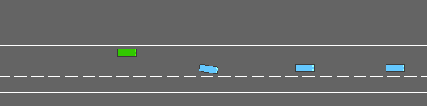

# Three-policy voting: correlated weak voters defeat a good member

The MAGI-inspired voting mechanism runs, but **majority voting degraded this driving policy**. On thirty new held-out games, the validation-selected single member had no collisions; majority voting had twenty, and probability averaging had three. This is a useful negative result: independent training seeds did not create three complementary competent policies.

| Policy | Mean return | Collisions | Mean distance | Mean speed |
|---|---:|---:|---:|---:|
| Member1, best single selected on validation | 28.67 | 0/30 | 403.00m | 20.08m/s |
| Member2 | 23.48 | 20/30 | 349.84m | 24.85m/s |
| Member3 | 23.48 | 20/30 | 349.84m | 24.85m/s |
| Three-member majority | 23.48 | 20/30 | 349.84m | 24.85m/s |
| Three-member probability mean | 27.74 | 3/30 | 393.85m | 21.09m/s |
| Always-slower rule | 28.67 | 0/30 | 403.00m | 20.08m/s |

See [full per-game results](magi/summary.json), [validation selection and model hashes](magi/selection.json), and the [fixed protocol](magi/protocol.json).

## Mechanism and independent training

Three copies of the same real PN→KC→MBON circuit start from identical untrained weights. All fourteen initial Safetensors tensors match ([check](magi/initialization-check.json)). Each receives 128 training episodes with independent action RNG seeds 11/22/33 and nonoverlapping environment seed ranges 5000–5127,6000–6127,7000–7127. The reward, learning rate 0.01, architecture, encoder, and action meanings stay fixed. These are independently experienced policies, not three copies of one trained checkpoint and not reconstructed biological fly swarm interactions.

The existing reward learner retains weights within a training run, resets the simulator each episode, and updates once per four episodes. Each member selects its initial/32/64/96/128-episode checkpoint on the same eight validation games 30000–30007. Member1 also wins the best-single comparison on validation. All checkpoints and both voting rules are fixed before test seeds 40000–40029. These validation/test seeds were not used in the earlier driving-game experiment. There is no test-time training or ensemble rule tuning.

At each ensemble decision, all three frozen members receive exactly the same rates. Majority voting counts each member's argmax. If no majority exists, average probability among tied actions breaks the tie, then lowest index resolves exact equality. Probability averaging directly averages full distributions before argmax. There are no member roles, different reward objectives, reliability weights, or built-in safety vetoes in this first experiment.

Three full members consume 384 training episodes versus 128 for a single member, as well as approximately three times the model storage. This is not a compute-matched demonstration. Saved members remain separate Safetensors files and the [ensemble bundle](magi/bundle.json) records their paths and meanings.

## Why majority failed

On every observed ensemble decision, member1 voted slower while members2 and3 voted idle. Member2 and3 agreed with each other 100% of the time; each disagreed with member1 on 100% of observations. The votes were therefore not three independent pieces of evidence. Two correlated weak policies systematically overrode the conservative learned behavior.

There were no unanimous or all-different votes in this run. The tie-break rule was covered by unit tests but was not exercised by the observed games. The majority game had 841 decisions; the probability-mean game had 1129, because their different actions changed episode lengths and future states. Within each trajectory the inputs are shared across members; decisions across these two different trajectories are not treated as paired observations.

Probability averaging preserved information discarded by argmax voting and often followed the slower preference. It improved substantially over majority but still did not beat the validation-selected single member. These probabilities were not calibrated as measures of expertise. Even unanimous agreement would not establish correctness, and cloning a policy cannot manufacture independent judgment.

This result suggests that a future committee should qualify members on validation performance and measure redundant behavior before assigning equal votes. Correlation-aware grouping, performance-weighted voting, or abstention would be separate mechanisms requiring fresh evaluation. None is claimed as implemented or proven here. More diverse reward objectives would also change the meaning of consensus and require explicit tradeoffs.

## Runtime and artifacts

Three persistent API models were queried sequentially. Majority member-inference plus aggregation averaged 1.292 ms, p95 1.507ms, maximum 1.965 ms across 841 decisions on the M2 Ultra. Probability averaging averaged 1.275 ms across 1129 decisions. These timings exclude observation encoding, simulator stepping, and initial model loading; they are not camera-to-actuator latency or a hard real-time guarantee.

The reusable aggregator is [ensemble_policy.py](../scripts/ensemble_policy.py). [train_magi.py](../scripts/train_magi.py) reproduces the training/evaluation; [play_magi.py](../scripts/play_magi.py) loads the bundle for a local game window or offscreen GIF. Input ID order and numeric distributions are checked; callers must preserve common action semantics. The tests check majority versus confidence, all-different ties, clone invariance, and malformed probabilities. All 14 Python tests passed; the Rust core was unchanged.

The first test seed was chosen for rendering in advance, not selected for an impressive outcome. Raw [majority decisions](magi/majority-decisions.json) and [probability-mean decisions](magi/mean-decisions.json) record individual votes and latency. [Execution instructions](../examples/magi/README.md) include replay commands. As with the prior game, observations are structured kinematics and the environment's high-level speed controller makes always-slow an easy successful rule. These results do not demonstrate complex driving or general swarm intelligence.
